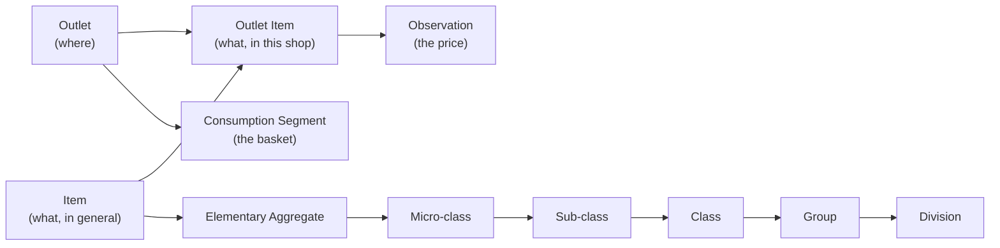
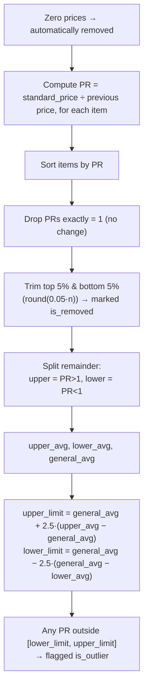
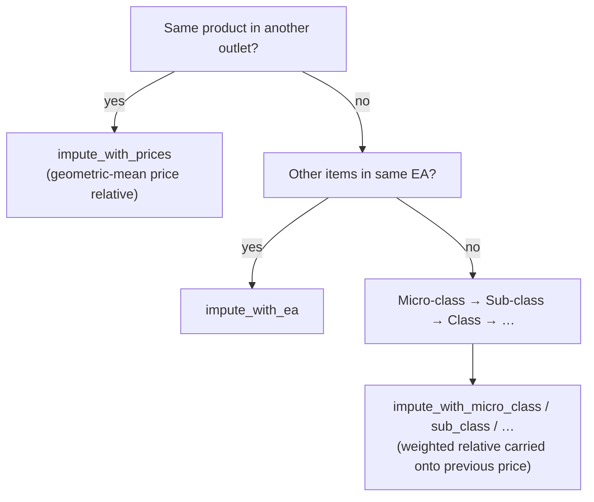
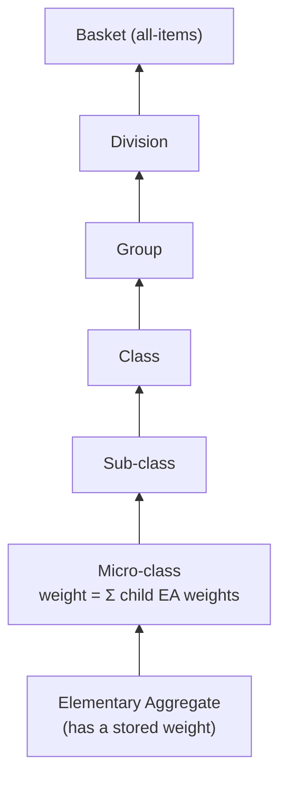
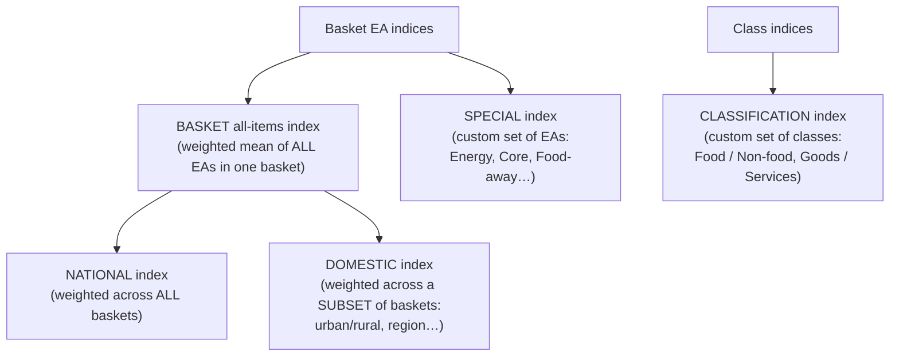
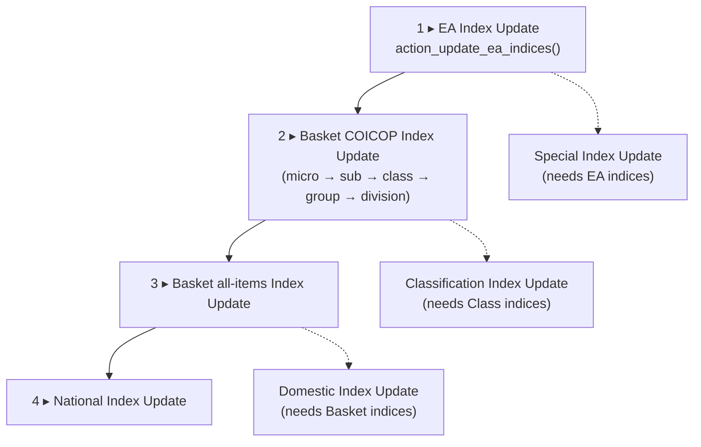

# How the HCPI Is Computed — A Guided Tour Through the Code

**Audience:** developers adapting this system for their own country, and statisticians who need to confirm the numbers are produced correctly.

**What this is:** a plain-language walk through the *journey of a price* — from a single price quote collected in a shop, all the way up to the national all-items inflation index — with the exact functions, models, and formulas pointed out at every step.

> **One-sentence summary:** A price is collected → turned into a *price relative* (a ratio) → averaged with a *geometric mean* into an elementary-aggregate index (a **Jevons** index) → then **weighted and added up** the COICOP classification ladder (a **Laspeyres-type** aggregation) into class, group, division, basket, and finally national indices.

---

## Table of contents

1. [The big picture](#1-the-big-picture)
2. [The vocabulary (read this first)](#2-the-vocabulary-read-this-first)
3. [The module map — who does what](#3-the-module-map--who-does-what)
4. [Stage 1 — Collecting a price (the input layer)](#4-stage-1--collecting-a-price-the-input-layer)
5. [Stage 2 — Price relatives: the two kinds, and why](#5-stage-2--price-relatives-the-two-kinds-and-why)
6. [Stage 3 — Cleaning the data: the Tukey outlier algorithm, inliers & imputation](#6-stage-3--cleaning-the-data-the-tukey-outlier-algorithm-inliers--imputation)
7. [Stage 4 — The elementary aggregate index (the foundation: a Jevons index)](#7-stage-4--the-elementary-aggregate-index-the-foundation-a-jevons-index)
8. [Stage 5 — Climbing the COICOP ladder (weighted aggregation)](#8-stage-5--climbing-the-coicop-ladder-weighted-aggregation)
9. [Stage 6 — Basket, national, domestic, special & classification indices](#9-stage-6--basket-national-domestic-special--classification-indices)
10. [The zero-price safety gate](#10-the-zero-price-safety-gate)
11. [How the computations are triggered & sequenced](#11-how-the-computations-are-triggered--sequenced)
12. [Country differences — what changes between Uganda, Kenya, Tanzania, South Africa…](#12-country-differences--what-changes-between-uganda-kenya-tanzania-south-africa)
13. [Quick formula reference card](#13-quick-formula-reference-card)

---

## 1. The big picture

The HCPI (Harmonised Consumer Price Index) measures how the average price of a fixed "basket" of goods and services changes over time. The system builds this number from the bottom up, in two distinct mathematical steps:

```mermaid
flowchart TD
    A["Price quote<br/>(one item, one shop, one month)"] --> B["Price relative<br/>(this price ÷ a reference price)"]
    B --> C["Elementary Aggregate index<br/><b>GEOMETRIC mean</b> of relatives × 100<br/>(a Jevons index)"]
    C --> D["Micro-class → Sub-class → Class<br/>→ Group → Division"]
    D --> E["Basket (all-items) index<br/><b>WEIGHTED arithmetic mean</b><br/>(Laspeyres-type)"]
    E --> F["National index<br/>(weighted across all baskets)"]
    C -.-> G["Special indices<br/>(custom EA groups: e.g. Energy, Core)"]
    D -.-> H["Classification indices<br/>(custom class groups: e.g. Food / Non-food)"]
    E -.-> I["Domestic indices<br/>(regional / urban-rural sub-totals)"]

    style C fill:#fde68a,stroke:#b45309
    style E fill:#bbf7d0,stroke:#15803d
```



**The two key statistical moves:**

| Step | Where | Method | Why |
|---|---|---|---|
| Combining individual price quotes into the smallest published index (the *elementary aggregate*) | bottom of the ladder | **Geometric mean** of price relatives (Jevons index) | Standard international practice when expenditure weights below the EA are unknown |
| Combining elementary aggregates upward into class/group/division/national | every level above | **Weighted arithmetic mean**, weights = expenditure shares (Laspeyres-type) | Reflects how much households actually spend on each category |

This two-method design (geometric at the bottom, weighted-arithmetic above) is the **standard CPI/HICP construction** used internationally.

---

## 2. The vocabulary (read this first)

| Term | In the code | Plain meaning |
|---|---|---|
| **Observation** | `hcpi.outlet.item.observation` | One price quote: *one item, in one outlet, on one date.* The atom of the whole system. |
| **Outlet** | `hcpi.outlet` | A shop / market / vendor where prices are collected. |
| **Item** | `hcpi.item` | A precisely specified product (e.g. "white bread loaf, 500g"). |
| **Outlet Item** | `hcpi.outlet.item` | A specific item *as sold in a specific outlet* — this is what gets a price each month. Carries the `base_price`. |
| **Elementary Aggregate (EA)** | `hcpi.elementary.aggregate` | The lowest level at which an index is published (e.g. "Bread"). The foundation. |
| **COICOP hierarchy** | `hcpi.micro.class` → `hcpi.sub.class` → `hcpi.class` → `hcpi.group` → `hcpi.division` | The internationally standard classification ladder above the EA. |
| **Consumption Segment (a "basket")** | `hcpi.consumption.segment` | A population stratum — typically *region × household type* (e.g. "Kampala Urban"). Each has its own weights. |
| **Weight** | `hcpi.ea.weight` | The expenditure share of an EA within a basket. Drives all aggregation above the EA. |
| **Price relative (PR)** | `long_term_price_relative`, `short_term_pr` | A *ratio* of two prices. The currency of price-change measurement. |
| **Base price** | `base_price` (on `hcpi.outlet.item`) | The reference-period price each long-term relative is measured against. |

---

## 3. The module map — who does what

The codebase separates **shared, harmonised computation** (identical for every country) from **country-specific geography & data entry**.

```mermaid
flowchart LR
    subgraph shared["SHARED — identical in every country"]
        direction TB
        comp["hcpi_computation<br/><i>math primitives, zero-price gate</i>"]
        coicop["hcpi_coicop<br/><i>COICOP hierarchy definitions</i>"]
        item["hcpi_item<br/><i>items & EA linkage</i>"]
        outlet["hcpi_outlet<br/><i>outlets, outlet-items, OBSERVATIONS, weights</i>"]
        dc["hcpi_data_collection<br/><i>questionnaires, Tukey, imputation</i>"]
        index["hcpi_index<br/><i>ALL index computations</i>"]
    end
    subgraph country["COUNTRY-SPECIFIC — geography & entry only"]
        direction TB
        loc["{country}_location<br/><i>region/district/zone…</i>"]
        cout["{country}_outlet<br/><i>outlet ↔ geography</i>"]
        cdc["{country}_data_collection<br/><i>validation by zone/region</i>"]
        cimp["{country}_base_import<br/><i>spreadsheet importers</i>"]
    end
    country -.customises.-> shared
```



| Module | Role in the computation story |
|---|---|
| [hcpi_computation/](../hcpi_computation/) | The **abstract base** every other model inherits. Holds the shared math: price relatives, geometric mean, outlier detection, and the zero-price safety gate. |
| [hcpi_coicop/](../hcpi_coicop/) | Defines the **classification ladder**: division → group → class → sub-class → micro-class → elementary aggregate, with the COICOP codes. |
| [hcpi_item/](../hcpi_item/) | Defines **items** and links each item to its elementary aggregate. |
| [hcpi_outlet/](../hcpi_outlet/) | Defines **outlets, outlet-items, observations, and EA weights** — the input data and the weights. |
| [hcpi_data_collection/](../hcpi_data_collection/) | The **field workflow**: questionnaires → validation → outlier removal/imputation → permanent observations. |
| [hcpi_index/](../hcpi_index/) | **Every index calculation** lives here, under [models/computations/](../hcpi_index/models/computations/). |

---

## 4. Stage 1 — Collecting a price (the input layer)

**Goal of this stage:** turn a field visit into a clean, classified `hcpi.outlet.item.observation` record.

### What one observation is

A single record in [hcpi_outlet/models/hcpi_outlet_item_observation.py](../hcpi_outlet/models/hcpi_outlet_item_observation.py) means: *"On this date, this item, in this outlet, cost this much."*

The important fields ([lines 18–38](../hcpi_outlet/models/hcpi_outlet_item_observation.py#L18-L38)):

| Field | Meaning |
|---|---|
| `observed_price` | the price the collector recorded |
| `observation_date` | the day it was collected |
| `outlet_item_id` | links to the item-in-outlet (and through it, to the COICOP classification and the `base_price`) |
| `base_price` | the reference-period price (pulled from the outlet-item) |
| `consumption_segment_id` | which basket this belongs to (pulled from the outlet) |
| `elementary_aggregate_id` | which EA this rolls up into |
| `month` / `readable_date` | the calendar month grouping, e.g. `"June_2026"` / `"June 2026"` ([lines 84–92](../hcpi_outlet/models/hcpi_outlet_item_observation.py#L84-L92)) |

### How a price is wired to the classification

Each price inherits its classification automatically through a chain of related fields:



So a collector only enters a price against an *outlet item* — the EA, COICOP codes, and basket all attach themselves automatically.

### From questionnaire to permanent record

The field workflow lives in [hcpi_data_collection/](../hcpi_data_collection/models/):

1. `hcpi.data.collection` — a questionnaire for one outlet on one date.
2. `hcpi.data.collection.line` — one line per item, producing a `standard_price` (price normalised to the standard quantity/unit).
3. `hcpi.data.validation` — groups all lines for one **basket × month**, runs cleaning (next stage), then writes the surviving prices into permanent `hcpi.outlet.item.observation` records.

---

## 5. Stage 2 — Price relatives: the two kinds, and why

A **price relative** is simply *one price divided by another*. The system never averages raw prices (you can't sensibly average UGX/kg of rice with UGX/litre of fuel) — it averages *ratios of change*, which are unit-free.

The shared helper, in [hcpi_computation/models/hcpi_computation.py](../hcpi_computation/models/hcpi_computation.py#L168-L172):

```python
def compute_pr(self, current_price, previous_price):
    if current_price and previous_price:
        return current_price / previous_price if previous_price else 0
    else:
        return 0
```

> **Note for statisticians:** if either price is missing or zero, the relative is set to **0**, not 1. Zero relatives are deliberately *excluded* from the geometric mean later (see Stage 4) so they don't corrupt the index — they signal "no usable data," not "no price change."

The system computes **two different price relatives per observation**, defined in [hcpi_outlet_item_observation.py](../hcpi_outlet/models/hcpi_outlet_item_observation.py#L95-L149):

### (a) Long-term price relative — `long_term_price_relative`

```python
@api.depends('base_price','observed_price')
def _compute_long_term_pr(self):
    for rec in self:
        rec.long_term_price_relative = rec.compute_pr(rec.observed_price, rec.base_price)
```

$$ \text{PR}_{\text{long}} = \frac{\text{observed price (this month)}}{\text{base price (reference period)}} $$

**What it measures:** the *cumulative* price change since the fixed base/reference period. This feeds the **long-term index**, which is the main published level.

### (b) Short-term price relative — `short_term_pr`

```python
@api.depends('observed_price', 'observation_date', 'outlet_item_id', 'base_price')
def _compute_short_term_pr(self):
    ...
    # SQL finds the SAME outlet-item's price in the PREVIOUS calendar month
    for rec in dated_records:
        previous_price = previous_price_by_record.get(rec.id)
        if previous_price:
            rec.short_term_pr = rec.compute_pr(rec.observed_price, previous_price)
        else:
            rec.short_term_pr = rec.compute_pr(rec.observed_price, rec.base_price)
```

$$ \text{PR}_{\text{short}} = \frac{\text{observed price (this month)}}{\text{price of same item, previous month}} $$

**What it measures:** the *month-on-month* change. If there is no previous-month price, it falls back to the base price. This feeds the **short-term index**, which is then **chained** (see Stage 4) so that month-on-month movements link into a continuous series.

> The previous-month lookup is done with a single efficient SQL `LATERAL` join ([lines 114–131](../hcpi_outlet/models/hcpi_outlet_item_observation.py#L114-L131)) that grabs the most recent observation of the *same outlet-item* in the prior calendar month.

| | Long-term relative | Short-term relative |
|---|---|---|
| **Compared against** | fixed base period | previous month |
| **Feeds** | long-term index (level) | chained short-term index |
| **Field** | `long_term_price_relative` | `short_term_pr` |
| **Captures** | total change since base | latest monthly movement |

---

## 6. Stage 3 — Cleaning the data: the Tukey outlier algorithm, inliers & imputation

Before any index is built, suspicious prices are flagged and gaps are filled. This all lives in [hcpi_data_collection/models/hcpi_data_validation.py](../hcpi_data_collection/models/hcpi_data_validation.py).

### The Tukey outlier algorithm — `run_turkey()`

> **Naming note:** the method is spelled `run_turkey` in the code, but statistically this is the **Tukey algorithm** — the same outlier method recommended by Eurostat for the HICP. The spelling is a typo, not a different method.

The algorithm runs per **basket × month** ([lines 144–230](../hcpi_data_collection/models/hcpi_data_validation.py#L144-L230)):



The bounds, verbatim from the code ([lines 218–229](../hcpi_data_collection/models/hcpi_data_validation.py#L218-L229)):

```python
upper_limit = general_average + (2.5 * (upper_average - general_average))
lower_limit = general_average - (2.5 * (general_average - lower_average))
...
for index, item in enumerate(item_records):
    if item['price_relative'] > upper_limit or item['price_relative'] < lower_limit:
        item['line'].is_outlier = True
```

**Plain language:** find the typical upward move and the typical downward move, then flag anything that moved *much* more than typical (2.5× beyond the centre). The 5% trim first removes the wildest values so they don't distort the averages used to set the bounds.

> **For statisticians:** the multiplier (`2.5`) and the trim fraction (`5%`, via `round(0.05 * len(...))`) are the tunable parameters of this implementation. They are hard-coded here; adapting them is a deliberate methodological decision.

### Inliers — `validate_inliers()`

A price is flagged an **inlier** ([lines 243–256](../hcpi_data_collection/models/hcpi_data_validation.py#L243-L256)) if it has been *identical for the last 12 months*. Persistent non-movement can be just as much a data-quality flag (a forgotten/copy-pasted price) as a wild jump.

### Imputation — filling gaps

When a price is missing, the system estimates it rather than dropping the item, climbing the classification ladder until it finds usable data ([lines 303–660](../hcpi_data_collection/models/hcpi_data_validation.py#L303-L660)):



The principle at every level: take the *price relative* observed for the surrounding group (computed with the geometric mean, [hcpi_computation.py lines 174–176](../hcpi_computation/models/hcpi_computation.py#L174-L176)) and apply it to the item's own previous price. The imputed line is marked `is_imputed` with the method recorded for audit.

---

## 7. Stage 4 — The elementary aggregate index (the foundation: a Jevons index)

This is the single most important calculation. It lives in [hcpi_index/models/basket_coicop_indices/hcpi_basket_ea_index.py](../hcpi_index/models/basket_coicop_indices/hcpi_basket_ea_index.py).

For every **EA × consumption segment × month**, the system computes the **geometric mean of the price relatives** of all the individual items in that EA. The geometric mean of ratios is the **Jevons index** — the international standard for elementary aggregates without sub-weights.

The geometric mean is computed directly in SQL, in `_get_geo_mean_lookup()` ([lines 241–259](../hcpi_index/models/basket_coicop_indices/hcpi_basket_ea_index.py#L241-L259)):

```sql
SELECT
    outlet_item.elementary_aggregate_id AS ea_id,
    outlet_item.consumption_segment_id AS segment_id,
    date_trunc('month', observation.observation_date)::date AS month_start,
    EXP(AVG(LN(observation.{value_field}))) AS geo_mean      -- <-- the geometric mean
FROM hcpi_outlet_item_observation observation
JOIN hcpi_outlet_item outlet_item ON outlet_item.id = observation.outlet_item_id
WHERE ...
  AND observation.{value_field} > 0                           -- <-- only positive relatives
GROUP BY ea_id, segment_id, month_start
```

`EXP(AVG(LN(x)))` is the textbook identity for a geometric mean:

$$ \text{GeoMean}(x_1,\dots,x_n) = \left(\prod_i x_i\right)^{1/n} = \exp\!\left(\frac{1}{n}\sum_i \ln x_i\right) $$

The same SQL is run twice — once with `value_field = long_term_price_relative`, once with `short_term_pr` — giving a long-term and a short-term geometric mean per EA/segment/month.

> **Why only `> 0`?** Zero or negative relatives (missing data, see Stage 2) would make `LN(x)` undefined or pull the product to zero. Excluding them means the EA index reflects only items that actually have a usable price.

### Turning the geometric mean into an index

In `_job_compute_indices_for_segment()` ([lines 370–454](../hcpi_index/models/basket_coicop_indices/hcpi_basket_ea_index.py#L370-L454)):

**Long-term index** (a level, base = 100):

```python
'long_term_index': long_term_geo_mean * 100 if long_term_geo_mean else 0,
```

$$ I^{\text{long}}_{\text{EA}} = \text{GeoMean}(\text{long-term relatives}) \times 100 $$

**Short-term index** (chained month-on-month):

```python
if short_term_geo_mean:
    short_term_index = (
        short_term_geo_mean * 100              # first month: anchor at 100
        if previous_short_term_index is None
        else short_term_geo_mean * previous_short_term_index   # chain link
    )
```

$$ I^{\text{short}}_{t} = \text{GeoMean}(\text{short-term relatives}_t) \times I^{\text{short}}_{t-1} $$

**Chaining** means each month's movement is multiplied onto the previous month's index level, producing a continuous series — this is how short-term (month-on-month) movements accumulate into a long-run trend.

The function also records rich **diagnostics** (why an index came out zero — no observations? non-positive relatives? missing geo-mean? a zero cascading from a previous month) at [lines 390–434](../hcpi_index/models/basket_coicop_indices/hcpi_basket_ea_index.py#L390-L434). This is invaluable for statisticians auditing a suspicious zero.

---

## 8. Stage 5 — Climbing the COICOP ladder (weighted aggregation)

From the EA upward, the system switches method: it takes a **weighted arithmetic mean** of the child indices, where the weights are **expenditure shares**. This is the **Laspeyres-type** part of the construction.

### Where weights live

Weights are stored *only at the EA level*, in `hcpi.ea.weight` ([hcpi_outlet/models/hcpi_ea_weight.py](../hcpi_outlet/models/hcpi_ea_weight.py)) — one weight per **(elementary aggregate × consumption segment)**. Every higher-level weight is simply the **sum of the EA weights beneath it**.



### The universal aggregation formula

Every level above the EA uses the same pattern. From [hcpi_index/models/computations/basket_coicop_index_update.py](../hcpi_index/models/computations/basket_coicop_index_update.py#L334-L355):

```python
indices = []
total_weight = 0
for long_term_idx, ea_id in ea_data:
    weight = weight_lookup['ea'].get((ea_id, basket.id), 0)
    if weight:
        indices.append(long_term_idx * weight)   # numerator term
        total_weight += weight                    # denominator term
computed_index = sum(indices) / total_weight if total_weight else 0
```

$$ I_{\text{parent}} = \frac{\sum_{c}\, I_c \cdot w_c}{\sum_{c}\, w_c} $$

where $I_c$ is each child's index and $w_c$ its weight. This exact formula is applied at every rung — micro-class aggregates EAs, sub-class aggregates micro-classes, and so on:

| Level computed | From | Function |
|---|---|---|
| Micro-class | EA indices | `_process_micro_class_indices` ([L305–381](../hcpi_index/models/computations/basket_coicop_index_update.py#L305-L381)) |
| Sub-class | micro-class indices | `_process_sub_class_indices` ([L383–456](../hcpi_index/models/computations/basket_coicop_index_update.py#L383-L456)) |
| Class | sub-class indices | `_process_class_indices` ([L458–530](../hcpi_index/models/computations/basket_coicop_index_update.py#L458-L530)) |
| Group | class indices | `_process_group_indices` ([L532–604](../hcpi_index/models/computations/basket_coicop_index_update.py#L532-L604)) |
| Division | group indices | `_process_division_indices` ([L606–678](../hcpi_index/models/computations/basket_coicop_index_update.py#L606-L678)) |

> **Performance note for developers:** each function pre-fetches *all* child indices and *all* weights once into dictionaries, then does the arithmetic in memory with O(1) lookups — avoiding per-record database queries. This is why the files build `weight_lookup` and `*_indices_lookup` dictionaries up front.

---

## 9. Stage 6 — Basket, national, domestic, special & classification indices

Once the COICOP ladder is built for each basket, several "headline" indices are produced. All of them reuse the same weighted-mean formula from Stage 5 — they differ only in *what they sum over*.



| Index | File | What it aggregates over | Use |
|---|---|---|---|
| **Basket (all-items)** | [basket_index_update.py](../hcpi_index/models/computations/basket_index_update.py) | every EA in **one** consumption segment | the headline number *for one population stratum* |
| **National** | [national_index_update.py](../hcpi_index/models/computations/national_index_update.py) | every basket combined, at each COICOP level | the **national headline inflation** number |
| **Domestic** | [domestic_index_update.py](../hcpi_index/models/computations/domestic_index_update.py) | a chosen subset of baskets (a "domestication", e.g. urban vs rural, or a region) | regional / sub-population sub-totals |
| **Special** | [special_index_update.py](../hcpi_index/models/computations/special_index_update.py) | a *custom* set of EAs (`hcpi.special.index.category`) | analytical aggregates outside COICOP — e.g. Energy, Core inflation |
| **Classification** | [classification_index_update.py](../hcpi_index/models/computations/classification_index_update.py) | a *custom* set of COICOP **classes** | alternative groupings — e.g. Food / Non-food, Goods / Services |

**Basket vs National** is the key distinction:
- A **basket** index describes price change for *one stratum* (e.g. "Kampala Urban").
- The **national** index re-aggregates across *all* baskets, weighting each basket's components by their EA weights — producing the country-wide figure.

The national module computes a national figure at **every** COICOP level (`coicop` field = "Elementary Aggregate", "Micro Class", … "Division"), so you can read national inflation for any classification level, not just the top.

---

## 10. The zero-price safety gate

A **zero observed price is almost always a data error** (a forgotten entry), and it would silently corrupt every index above it. The abstract base model [hcpi_computation.py](../hcpi_computation/models/hcpi_computation.py#L31-L147) therefore enforces a hard rule:

> If any active observation has `observed_price = 0`, **computation stops from that month onward** until the price is corrected. Earlier "safe" months are still computed.

- `get_zero_price_validation_status()` ([L31–121](../hcpi_computation/models/hcpi_computation.py#L31-L121)) finds the first month containing a zero price and builds a human-readable warning listing the affected months and sample items.
- `filter_date_observations_for_zero_prices()` ([L123–131](../hcpi_computation/models/hcpi_computation.py#L123-L131)) and `filter_month_keys_for_zero_prices()` ([L133–142](../hcpi_computation/models/hcpi_computation.py#L133-L142)) drop the unsafe months before any index runs.
- `validate_no_zero_price_months()` ([L144–147](../hcpi_computation/models/hcpi_computation.py#L144-L147)) raises a blocking error if the very first queued month is contaminated.

Every index-update wizard calls these filters before computing.

---

## 11. How the computations are triggered & sequenced

Each index level has an **update wizard** under [hcpi_index/models/computations/](../hcpi_index/models/computations/) — e.g. `hcpi.ea.index.update`, `hcpi.basket.coicop.index.update`, `hcpi.national.index.update`. They all inherit `hcpi.computation` and expose an `action_update_*()` button.

### The required order

Because each level reads the level below, computation must run **bottom-up**:



### Concurrency & background processing

- **EA computation is offloaded to a background queue job** (`queue_job` / `with_delay()`), on channel `root.hcpi_ea`, one job per consumption segment (`_job_compute_indices_for_segment`, [L327](../hcpi_index/models/basket_coicop_indices/hcpi_basket_ea_index.py#L327)). Large datasets won't block the UI.
- A **PostgreSQL advisory lock** (`pg_try_advisory_xact_lock(31818, segment_id)`, [L332](../hcpi_index/models/basket_coicop_indices/hcpi_basket_ea_index.py#L332)) guarantees two workers never compute the same segment simultaneously.
- Each wizard checks that **no other computation is already running** (mutual exclusion) before starting, keeping the layers consistent.
- Progress is reported to the user via `web_progress`.

---

## 12. Country differences — what changes between Uganda, Kenya, Tanzania, South Africa…

This repository is one codebase with **per-country git branches**: `ug_18` (Uganda), `ke_18` (Kenya), `tz_18` (Tanzania), `zar_18` (South Africa), plus `rw`, `bi`, `ss`. The `_18` suffix denotes Odoo 18.0.

**The headline finding for statisticians:** the **calculation logic is byte-for-byte identical across every country.** A `git diff` of the computation modules (`hcpi_computation`, `hcpi_index`, `hcpi_data_collection`, `hcpi_coicop`, `hcpi_outlet`, `hcpi_item`) between `ug_18`, `ke_18`, `tz_18`, and `zar_18` returns **no differences**. The geometric-mean EA index, the Tukey algorithm, the weighting, and the chaining are *harmonised* — which is exactly the point of a **Harmonised** CPI across the East African Community.

**What *does* differ between countries** is purely the **geographic dimension and data-entry layer**, in the `{country}_*` modules:

| Country | Geographic hierarchy modules | Geographic levels |
|---|---|---|
| Uganda (`ug_18`) | `ug_location`, `ug_outlet` | Region → District → County → Sub-county → Parish |
| Kenya (`ke_18`) | `ke_location`, `ke_outlet` | Region → Zone |
| Tanzania (`tz_18`) | `tz_location`, `tz_outlet` | (Tanzania's regional structure) |
| South Africa (`zar_18`) | `zar_location`, `zar_outlet` | (RSA's regional structure) |

The only computation-adjacent override is cosmetic: each country's `hcpi.data.validation` is extended to label validation batches by its own geography (e.g. Kenya groups by `zone_id` instead of consumption segment for the record *name*) — see `ke_data_collection/models/hcpi_data_validation.py`. **The Tukey math and imputation logic it inherits are unchanged.**

> **For a developer onboarding a new country:** you do **not** touch the index math. You create `{country}_location` (your administrative hierarchy), `{country}_outlet` (link outlets to that hierarchy and parse your outlet-code format), `{country}_data_collection` (label validation by your geography), and `{country}_base_import` (your spreadsheet importer). The shared `hcpi_*` modules then produce harmonised indices automatically.

---

## 13. Quick formula reference card

| Quantity | Formula | Code location |
|---|---|---|
| **Long-term price relative** | `observed_price / base_price` | [hcpi_outlet_item_observation.py L95–98](../hcpi_outlet/models/hcpi_outlet_item_observation.py#L95-L98) |
| **Short-term price relative** | `observed_price / previous-month price` (fallback: base) | [L100–149](../hcpi_outlet/models/hcpi_outlet_item_observation.py#L100-L149) |
| **EA geometric mean (Jevons)** | `EXP(AVG(LN(price_relative)))`, positive relatives only | [hcpi_basket_ea_index.py L247](../hcpi_index/models/basket_coicop_indices/hcpi_basket_ea_index.py#L247) |
| **EA long-term index** | `geo_mean × 100` | [L450](../hcpi_index/models/basket_coicop_indices/hcpi_basket_ea_index.py#L450) |
| **EA short-term index (chained)** | `geo_mean × previous_short_term_index` (first month × 100) | [L381–386](../hcpi_index/models/basket_coicop_indices/hcpi_basket_ea_index.py#L381-L386) |
| **Higher-level index (Laspeyres-type)** | `Σ(child_index × weight) / Σ(weight)` | [basket_coicop_index_update.py L355](../hcpi_index/models/computations/basket_coicop_index_update.py#L355) |
| **Higher-level weight** | `Σ(child EA weights)` | derived in each `_process_*` |
| **Tukey outlier bounds** | `gen_avg ± 2.5·(side_avg − gen_avg)`, after 5% trim | [hcpi_data_validation.py L218–221](../hcpi_data_collection/models/hcpi_data_validation.py#L218-L221) |
| **Geometric mean helper** | `array.prod() ** (1/n)` | [hcpi_computation.py L174–176](../hcpi_computation/models/hcpi_computation.py#L174-L176) |

---

### In one breath, for the layman

> Collectors record prices. Each price is turned into a *ratio* showing how it changed. For the smallest product group, those ratios are blended with a **geometric mean** (which treats a doubling and a halving symmetrically) to get a baby index. Those baby indices are then **added up by how much households spend on each thing** — bread counts more than shoelaces — all the way up to one national inflation number. Along the way, the system **throws out crazy values** (the Tukey check), **fills small gaps** (imputation), and **refuses to compute** if it sees an impossible zero price.

---

*Generated from source on branch `ug_18`. All line numbers refer to that branch; the computation code is identical on `ke_18`, `tz_18`, and `zar_18`.*
