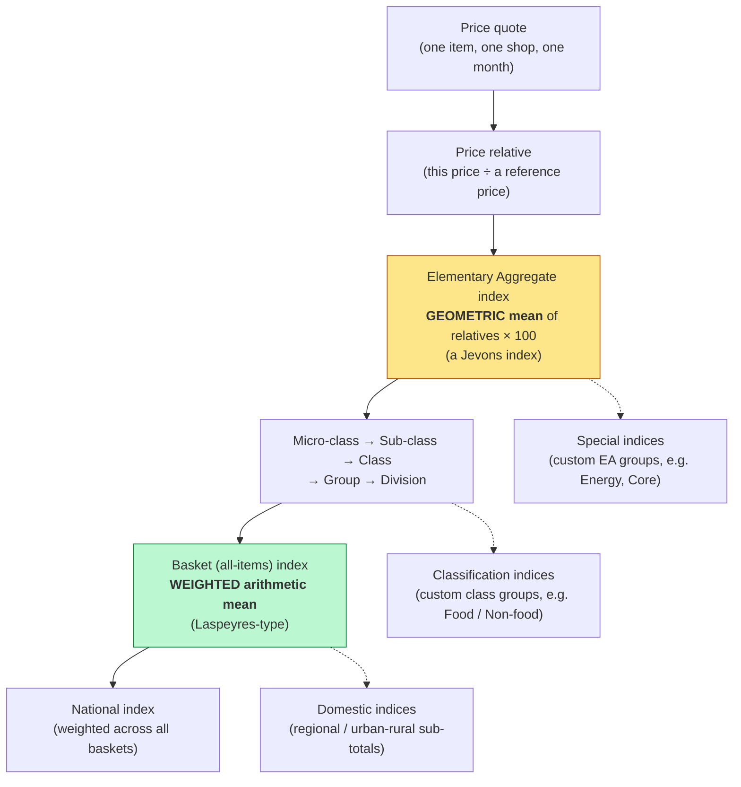
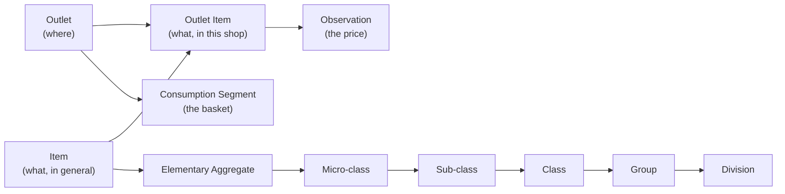
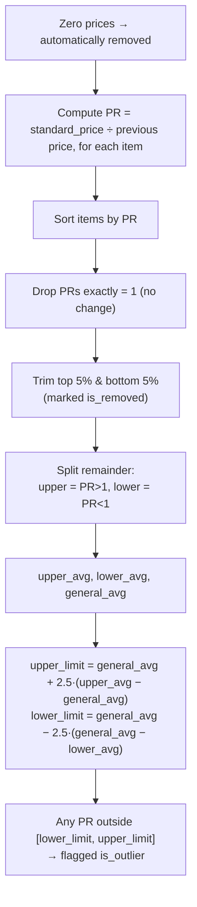
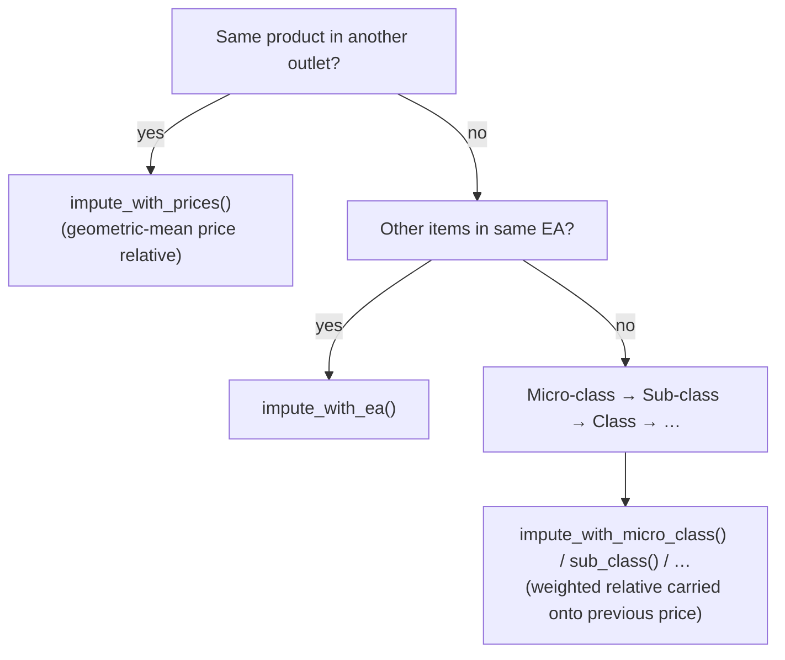
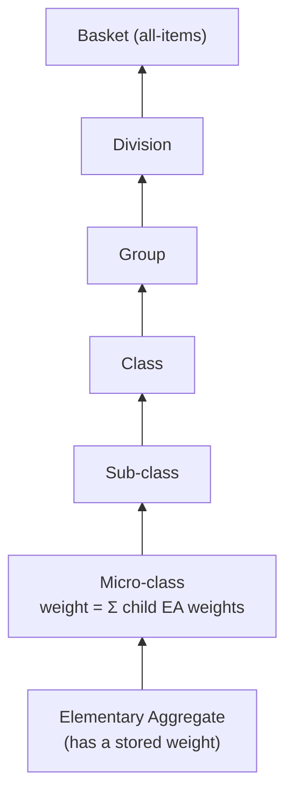
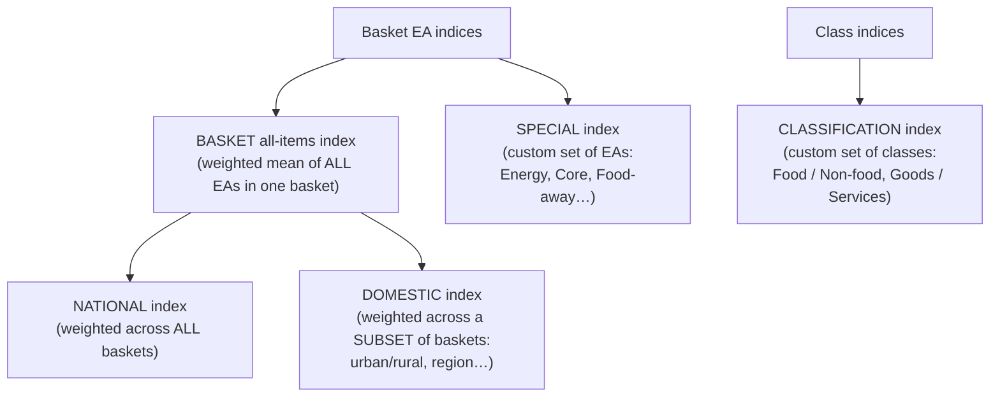
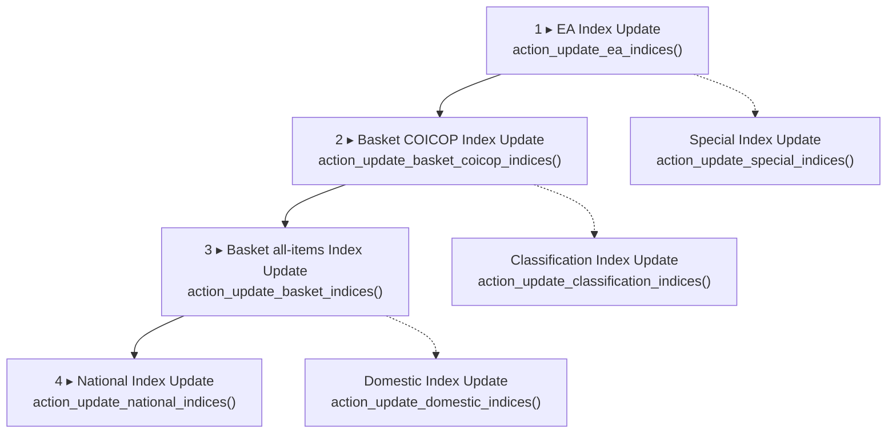

# How the Calculations Work

This page is the **mathematical journey** of an HCPI price: from one number written down in a shop to the single national inflation figure on the news. It's detailed enough for a statistician to verify the methodology, and explained plainly enough for a project sponsor or new developer to follow without a stats background.

If you want the *workflow* version (who clicks what, in which order), see [Data Flow Walkthrough](data-flow.md). For the gentlest possible introduction to what a CPI even is, see [CPI Explained](cpi-explained.md). For the **literal click-by-click guide in the Odoo UI** — which menu, which button, in what order — see [Using the System (UI Walkthrough)](../using-the-system.md).

!!! info "About the function names you'll see in this page"
    Throughout this page, you'll see references like *(in `compute_pr()`)* or *(`run_turkey()` in `hcpi_data_validation.py`)* attached to each calculation step. These are the **actual Python function and model names in the codebase** so a developer or statistician can grep for them and read the source to verify the maths. File paths are relative to the HCPI module root.

## In one breath

> Fieldworkers record prices. Each price is turned into a **ratio** showing how it changed. For the smallest product group, those ratios are blended with a **geometric mean** (which treats a doubling and a halving symmetrically). Those baby indices are then **added up by how much households spend on each thing** — bread counts more than shoelaces — all the way up to one national inflation number. Along the way, the system **throws out crazy values**, **fills small gaps**, and **refuses to compute** if it sees an impossible zero price.

That sentence is the whole page. Everything below is the same idea, with the maths, the safeguards, and a worked example.

## The two key statistical moves

The HCPI is built bottom-up in two distinct mathematical steps. Spotting which step you are in tells you which formula applies.

| Step | Where it happens | Method | Why |
|---|---|---|---|
| Blending individual price quotes into the smallest published index (the *elementary aggregate*) | Bottom of the ladder | **Geometric mean** of price relatives (a **Jevons** index) | International standard when sub-EA expenditure weights don't exist |
| Combining those baby indices upward into class, group, division, national | Every level above | **Weighted arithmetic mean** with expenditure shares (**Laspeyres-type**) | Reflects how much households actually spend on each category |

Keep this distinction in mind. **Gold = geometric mean at the bottom. Green = weighted mean above.** Two methods, two purposes.

## The vocabulary you need first

| Term | Plain meaning |
|---|---|
| **Observation** | One price quote: *one item, in one outlet, on one date.* The atom of the whole system. |
| **Outlet** | A shop, market, or vendor where prices are collected. |
| **Item** | A precisely specified product, e.g. *"white bread loaf, 500 g"*. |
| **Outlet Item** | A specific item *as sold in a specific outlet* — what gets a price each month. Carries the `base_price`. |
| **Elementary Aggregate (EA)** | The lowest level at which an index is published (e.g. *"Bread"*). The foundation. |
| **COICOP hierarchy** | The international classification ladder above the EA: micro-class → sub-class → class → group → division. |
| **Consumption Segment (a "basket")** | A population stratum, typically *region × household type* (e.g. *"Kampala Urban"*). Each basket has its own weights. |
| **Weight** | The expenditure share of an EA within a basket. Drives all aggregation above the EA. |
| **Price relative (PR)** | A *ratio* of two prices — the currency of price-change measurement. |
| **Base price** | The reference-period price each long-term relative is measured against. |

## The journey of a price — overview



The rest of this page walks each of those boxes.

## Stage 1 — Collecting a price (the input layer)

A single price record means: *"On this date, this item, in this outlet, cost this much."* The record lives in model **`hcpi.outlet.item.observation`** (file: `hcpi_outlet/models/hcpi_outlet_item_observation.py`). The important fields are:

| Field | Meaning |
|---|---|
| `observed_price` | The price the collector recorded |
| `observation_date` | The day it was collected |
| `outlet_item_id` | Links to the item-in-outlet (and through it, to the COICOP classification and `base_price`) |
| `base_price` | The reference-period price, pulled from the outlet-item |
| `consumption_segment_id` | Which basket this belongs to, pulled from the outlet |
| `elementary_aggregate_id` | Which EA this rolls up into |
| `month` / `readable_date` | Calendar-month grouping, e.g. `"June_2026"` / `"June 2026"` (computed by `_compute_month` and `_compute_readable_date`) |

Critically, the collector only enters a price against an *outlet item*. The EA, COICOP codes, and basket attach themselves automatically through this chain of related fields:



The field workflow is: a **data collection** (`hcpi.data.collection` — a questionnaire for one outlet on one date) generates **collection lines** (`hcpi.data.collection.line`, one per item, each producing a `standard_price` normalised to the standard unit), which are then grouped into a **data validation** (`hcpi.data.validation`, one batch per basket × month) — that's where cleaning happens before observations become permanent.

## Stage 2 — Price relatives: the two kinds, and why

A **price relative** is just *one price divided by another*. The system never averages raw prices (you can't sensibly average UGX/kg of rice with UGX/litre of fuel). It averages *ratios of change*, which are unit-free.

The helper — `compute_pr()` on the shared `hcpi.computation` base model (`hcpi_computation/models/hcpi_computation.py`) — is one line of arithmetic:

```python
def compute_pr(self, current_price, previous_price):
    if current_price and previous_price:
        return current_price / previous_price
    return 0
```

!!! note "For statisticians: zero relatives are intentional"
    If either price is missing or zero, the relative is set to **0**, not 1. Zero relatives are deliberately *excluded* from the geometric mean later (see Stage 4) so they don't corrupt the index — they signal *"no usable data"*, not *"no price change."*

Each observation produces **two** price relatives, both computed on `hcpi.outlet.item.observation`:

### Long-term price relative — field `long_term_price_relative`

Computed by `_compute_long_term_pr` (in `hcpi_outlet_item_observation.py`):

$$ \text{PR}_{\text{long}} = \frac{\text{observed price (this month)}}{\text{base price (reference period)}} $$

**What it measures:** the *cumulative* change since the fixed base period. Feeds the **long-term index** — the main published level (the "117.3" headline).

### Short-term price relative — field `short_term_pr`

Computed by `_compute_short_term_pr` (same file). It uses a single efficient SQL `LATERAL` join to find the most recent observation of the *same outlet-item* in the prior calendar month:

$$ \text{PR}_{\text{short}} = \frac{\text{observed price (this month)}}{\text{price of the same item, previous month}} $$

**What it measures:** the *month-on-month* change. If no previous-month price exists for that exact outlet-item, the system falls back to the base price. Feeds the **short-term index**, which is then **chained** (Stage 4) so monthly movements link into a continuous series.

| | Long-term | Short-term |
|---|---|---|
| **Compared against** | Fixed base period | Previous month |
| **Feeds** | Long-term index (level) | Chained short-term index |
| **Captures** | Total change since base | Latest monthly movement |

## Stage 3 — Cleaning the data

Before any index is built, suspicious prices are flagged and gaps are filled.

### The Tukey outlier algorithm — `run_turkey()`

This is the same outlier method recommended by Eurostat for the HICP. It runs once per **basket × month**, executed by `run_turkey()` on `hcpi.data.validation` (file: `hcpi_data_collection/models/hcpi_data_validation.py`).

> **Naming note:** the method is spelled `run_turkey` in the code (a typo), but statistically this is the **Tukey algorithm**. Same maths, just a misspelt method name.



The bounds:

$$ \text{upper} = \bar g + 2.5\,(\bar u - \bar g) \qquad \text{lower} = \bar g - 2.5\,(\bar g - \bar\ell) $$

where $\bar u$ is the mean of relatives above 1, $\bar\ell$ the mean below 1, and $\bar g$ the overall mean.

**Plain language:** find the typical upward move and the typical downward move, then flag anything that moved *much* more than typical (2.5× beyond the centre). The 5% trim first removes the wildest values so they don't distort the averages used to set the bounds.

!!! note "Methodological parameters"
    The multiplier (`2.5`) and the trim fraction (`5%`) are tunable parameters of this implementation. They are hard-coded; changing them is a deliberate methodological decision, not a config tweak.

### Inliers — `validate_inliers()`

A price is flagged as an **inlier** if it has been *identical for the last 12 months*. Persistent non-movement can be just as much a data-quality flag (a forgotten or copy-pasted price) as a wild jump. The check is `validate_inliers()` on `hcpi.data.validation`.

### Imputation — filling gaps

When a price is missing, the system *estimates* it rather than dropping the item — climbing the classification ladder until it finds usable data. Each rung has its own method on `hcpi.data.validation`:



The principle at every level: take the *price relative* observed for the surrounding group (computed with the **geometric mean** helper `compute_geo_mean()` on `hcpi.computation`) and apply it to the item's own previous price. The imputed observation is marked `is_imputed` with the imputation method recorded for audit. The whole imputation pass is kicked off by **`action_impute()`** on the data-validation form.

## Stage 4 — The elementary aggregate index (the foundation)

This is the single most important calculation in the system. It lives in `hcpi_index/models/basket_coicop_indices/hcpi_basket_ea_index.py`.

For every **EA × basket × month**, the system computes the **geometric mean of the price relatives** of all the individual items in that EA, then multiplies by 100. The geometric mean of price ratios is the **Jevons** index — the international standard for elementary aggregates without sub-weights.

The maths:

$$ I_{\text{EA}} = \left(\prod_{i=1}^{n}\text{PR}_i\right)^{1/n} \times 100 = \exp\!\left(\tfrac{1}{n}\sum_i \ln \text{PR}_i\right) \times 100 $$

It is computed directly in SQL by **`_get_geo_mean_lookup()`** on `hcpi.basket.ea.index`, using the identity `EXP(AVG(LN(x)))`:

```sql
SELECT
    outlet_item.elementary_aggregate_id AS ea_id,
    outlet_item.consumption_segment_id AS segment_id,
    date_trunc('month', observation.observation_date)::date AS month_start,
    EXP(AVG(LN(observation.long_term_price_relative))) AS geo_mean
FROM hcpi_outlet_item_observation observation
JOIN hcpi_outlet_item outlet_item ON outlet_item.id = observation.outlet_item_id
WHERE observation.long_term_price_relative > 0   -- only positive relatives
GROUP BY ea_id, segment_id, month_start
```

The same SQL runs twice — once for the long-term relative, once for the short-term — giving one geometric mean per direction per EA per basket per month.

!!! note "Why only `> 0`?"
    Zero or negative relatives (missing data, see Stage 2) would make `LN(x)` undefined or pull the product to zero. Excluding them means the EA index reflects only items that actually have a usable price.

### From geometric mean to index level

This happens inside **`_job_compute_indices_for_segment()`** — a background queue-job method on `hcpi.basket.ea.index` that runs once per consumption segment.

**Long-term index** (a level, anchored at base = 100):

$$ I^{\text{long}}_{\text{EA},t} = \text{GeoMean}(\text{long-term relatives}_t) \times 100 $$

**Short-term index** (chained month-on-month):

$$ I^{\text{short}}_{\text{EA},t} = \text{GeoMean}(\text{short-term relatives}_t) \times I^{\text{short}}_{\text{EA},t-1} $$

with the first month anchored at $\text{GeoMean} \times 100$.

**Chaining** means each month's movement is multiplied onto the previous month's level, producing a continuous series — that is how short-term movements accumulate into a long-run trend.

The same function also records rich **diagnostics** (why an index came out zero — no observations? non-positive relatives? missing geo-mean? a zero cascading from a previous month?), which is invaluable for auditing a suspicious result.

### Why a geometric mean, not an arithmetic one?

A geometric mean treats a doubling and a halving as equal-magnitude moves. An arithmetic mean does not.

Consider one item that doubles in price (PR = 2.0) and another that halves (PR = 0.5). On average, prices have not changed.

- **Geometric mean:** $\sqrt{2.0 \times 0.5} = 1.0$ ✓
- **Arithmetic mean:** $(2.0 + 0.5)/2 = 1.25$ ✗ (falsely claims 25% inflation)

This symmetry is why the geometric mean is the international standard at the elementary level.

## Stage 5 — Climbing the COICOP ladder (weighted aggregation)

From the EA upward, the system switches method. It takes a **weighted arithmetic mean** of the child indices, where the weights are **expenditure shares** — how much households actually spend on each category. This is the **Laspeyres-type** part of the construction.

### Where weights live

Weights are stored **only at the EA level** — one weight per (elementary aggregate × consumption segment), in model **`hcpi.ea.weight`** (`hcpi_outlet/models/hcpi_ea_weight.py`). Every higher-level weight is simply the **sum of the EA weights beneath it**.



### The universal aggregation formula

Every rung above the EA uses the same pattern. It lives in `hcpi_index/models/computations/basket_coicop_index_update.py` on model `hcpi.basket.coicop.index.update`:

$$ I_{\text{parent}} = \frac{\sum_{c}\, I_c \cdot w_c}{\sum_{c}\, w_c} $$

where $I_c$ is each child's index and $w_c$ its weight.

In code, this looks like:

```python
indices = []
total_weight = 0
for child_index, child_id in children:
    weight = weight_lookup.get((child_id, basket.id), 0)
    if weight:
        indices.append(child_index * weight)
        total_weight += weight
computed_index = sum(indices) / total_weight if total_weight else 0
```

This exact formula is applied at every rung, each by its own method:

| Level computed | From | Method on `hcpi.basket.coicop.index.update` |
|---|---|---|
| Micro-class | EA indices | `_process_micro_class_indices` |
| Sub-class | micro-class indices | `_process_sub_class_indices` |
| Class | sub-class indices | `_process_class_indices` |
| Group | class indices | `_process_group_indices` |
| Division | group indices | `_process_division_indices` |

> **Performance note for developers:** each `_process_*` function pre-fetches *all* child indices and *all* weights once into in-memory dictionaries (`weight_lookup`, `*_indices_lookup`), then does the arithmetic in pure Python with O(1) lookups — avoiding per-record database queries.

## Stage 6 — Basket, national and the side-cuts

Once the COICOP ladder is built for each basket, several "headline" numbers come out. They all reuse the same weighted-mean formula from Stage 5 — they differ only in *what they sum over*.



| Index | Update wizard (model) | Source file | What it aggregates over |
|---|---|---|---|
| **Basket (all-items)** | `hcpi.basket.index.update` | `hcpi_index/models/computations/basket_index_update.py` | Every EA in **one** consumption segment |
| **National** | `hcpi.national.index.update` | `hcpi_index/models/computations/national_index_update.py` | Every basket combined, at each COICOP level |
| **Domestic** | `hcpi.domestic.index.update` | `hcpi_index/models/computations/domestic_index_update.py` | A chosen subset of baskets (urban vs rural, region…) |
| **Special** | `hcpi.special.index.update` | `hcpi_index/models/computations/special_index_update.py` | A *custom* set of EAs (e.g. Energy, Core, Food-away) |
| **Classification** | `hcpi.classification.index.update` | `hcpi_index/models/computations/classification_index_update.py` | A *custom* set of COICOP classes (e.g. Food / Non-food) |

The key distinction: a **basket** index describes price change for *one stratum* (e.g. "Kampala Urban"). The **national** index re-aggregates across *all* baskets to produce the country-wide figure — and does so at every COICOP level, so national inflation is available for divisions, groups, classes, etc., not just the top.

## A fully worked example — bread in Kampala

Let's run a single number through the whole pipeline. The elementary aggregate is **Bread**, in the **Kampala Urban** basket.

### Step 1 — Three price quotes this month

| Shop | Price now (UGX) | Base price | Long-term relative |
|---|---|---|---|
| Shop A | 2,500 | 2,000 | 1.25 |
| Shop B | 2,200 | 2,000 | 1.10 |
| Shop C | 2,700 | 2,250 | 1.20 |

### Step 2 — The Tukey check

Suppose a fourth shop reports bread at **9,000 UGX** (relative 4.5) — clearly a typo. With the other three ratios sitting near 1.1–1.3, the upper Tukey limit lands well below 4.5, so the 4.5 is flagged and excluded before any index is built.

### Step 3 — The Bread EA index (Jevons)

The geometric mean of the three surviving relatives:

$$ \text{GeoMean}(1.25,\,1.10,\,1.20) = (1.25 \times 1.10 \times 1.20)^{1/3} = (1.65)^{1/3} \approx 1.1829 $$

Multiplied by 100:

$$ I_{\text{Bread}} \approx 118.3 $$

*Plain language:* bread costs about 18.3% more than it did in the base period.

### Step 4 — Climbing one rung: the "Bread and Cereals" class

The class sits one level above the EA. Suppose it has three EAs with these indices and weights (expenditure shares within the class):

| EA | Index | Weight | Index × Weight |
|---|---|---|---|
| Bread | 118.3 | 0.50 | 59.15 |
| Rice | 110.0 | 0.30 | 33.00 |
| Maize flour | 130.0 | 0.20 | 26.00 |
| **Total** | | **1.00** | **118.15** |

$$ I_{\text{class}} = \frac{59.15 + 33.00 + 26.00}{0.50 + 0.30 + 0.20} = 118.15 $$

*Plain language:* bread carries half the weight, so it pulls the class index closest to itself. Maize flour rose more (130), but matters less because households spend less on it.

### Step 5 — Up to the headline

The same `Σ(index × weight) / Σ(weight)` is applied at every higher rung — group, division, basket all-items. Then the **national** index is the weighted mean across all baskets. The single headline figure on the news comes out the top.

## The zero-price safety gate

A zero observed price is almost always a data error (a forgotten entry), and it would silently corrupt every index above it. The abstract base model **`hcpi.computation`** (file: `hcpi_computation/models/hcpi_computation.py`) therefore enforces a hard rule:

> If any active observation has `observed_price = 0`, **computation stops from that month onward** until the price is corrected. Earlier "safe" months are still computed.

Four helpers on `hcpi.computation` enforce this; every index-update wizard inherits them and calls them before computing:

| Function | Job |
|---|---|
| `get_zero_price_validation_status()` | Finds the first month containing a zero price and builds the human-readable warning listing affected months and sample items |
| `filter_date_observations_for_zero_prices()` | Drops the unsafe observations from the in-memory dataset before any index runs |
| `filter_month_keys_for_zero_prices()` | Drops the unsafe month buckets from the queue |
| `validate_no_zero_price_months()` | Raises a blocking error if the *very first* queued month is contaminated |

**A single impossible zero stops the whole calculation, on purpose.**

## How the computations are triggered

Each index level has an **update wizard** with a "Start Update" button (label `string="Start Update"` on the form view) that calls a method named `action_update_*_indices()`. Because each level reads the level below, computation must run **bottom-up**:



EA computation is offloaded to a background queue job (one job per consumption segment, scheduled in `_job_compute_indices_for_segment()`), and a PostgreSQL advisory lock — `pg_try_advisory_xact_lock(31818, segment_id)` — guarantees two workers never compute the same segment at once. Each wizard also checks that no other computation is already running before starting, keeping the layers consistent.

For the literal **click-by-click guide** — which menu, which form, which button label — see [Using the System (UI Walkthrough)](../using-the-system.md).

## One method, many countries

The repository is one codebase with **per-country git branches**: `ug_18` (Uganda), `ke_18` (Kenya), `tz_18` (Tanzania), `zar_18` (South Africa), plus `rw`, `bi`, `ss`. The `_18` suffix denotes Odoo 18.0.

**The headline finding for statisticians:** the calculation logic is byte-for-byte identical across every country. A `git diff` of the computation modules (`hcpi_computation`, `hcpi_index`, `hcpi_data_collection`, `hcpi_coicop`, `hcpi_outlet`, `hcpi_item`) between `ug_18`, `ke_18`, `tz_18`, and `zar_18` returns **no differences**. The geometric-mean EA index, the Tukey algorithm, the weighting, and the chaining are *harmonised* — which is exactly the point of a **Harmonised** CPI across the East African Community.

What *does* differ between countries is purely the **geographic dimension and data-entry layer** in the `{country}_*` modules:

| Country | Geographic modules | Geographic levels |
|---|---|---|
| Uganda (`ug_18`) | `ug_location`, `ug_outlet` | Region → District → County → Sub-county → Parish |
| Kenya (`ke_18`) | `ke_location`, `ke_outlet` | Region → Zone |
| Tanzania (`tz_18`) | `tz_location`, `tz_outlet` | Tanzania's regional structure |
| South Africa (`zar_18`) | `zar_location`, `zar_outlet` | RSA's regional structure |

For a developer onboarding a new country: you do **not** touch the index maths. You create `{country}_location` (your administrative hierarchy), `{country}_outlet` (link outlets to that hierarchy and parse your outlet-code format), `{country}_data_collection` (label validation by your geography), and `{country}_base_import` (your spreadsheet importer). The shared `hcpi_*` modules then produce harmonised indices automatically.

## Quick formula reference card

| Quantity | Formula | Where in the code |
|---|---|---|
| **Long-term price relative** | `observed_price / base_price` | `_compute_long_term_pr` in `hcpi_outlet_item_observation.py` |
| **Short-term price relative** | `observed_price / previous-month price` (fallback: base) | `_compute_short_term_pr`, same file |
| **Price-relative helper** | `current / previous` (returns 0 if either missing) | `compute_pr()` on `hcpi.computation` |
| **EA geometric mean (Jevons)** | `EXP(AVG(LN(price_relative)))`, positive relatives only | `_get_geo_mean_lookup()` on `hcpi.basket.ea.index` |
| **EA long-term index** | `geo_mean × 100` | `_job_compute_indices_for_segment()`, same file |
| **EA short-term index (chained)** | `geo_mean × previous_short_term_index` | same function |
| **Higher-level index (Laspeyres-type)** | `Σ(child_index × weight) / Σ(weight)` | `_process_*_indices` on `hcpi.basket.coicop.index.update` |
| **Higher-level weight** | `Σ(child EA weights)` | derived in each `_process_*` |
| **Tukey outlier bounds** | `gen_avg ± 2.5·(side_avg − gen_avg)`, after 5% trim | `run_turkey()` on `hcpi.data.validation` |
| **Inlier check** | identical price for 12 months | `validate_inliers()`, same model |
| **Imputation (per rung)** | apply geo-mean PR of surrounding group | `impute_with_prices() / _ea() / _micro_class() / …` |
| **Zero-price gate** | block months with `observed_price = 0` | `get_zero_price_validation_status()` etc. on `hcpi.computation` |

---

## Where to go next

- **[Data Flow Walkthrough](data-flow.md)** — the workflow version: who clicks what, in which order, to make these computations happen.
- **[CPI Concepts](cpi-concepts.md)** — the building blocks (basket, weights, base period) explained with the system's vocabulary.
- **[CPI Explained](cpi-explained.md)** — the gentlest introduction, no maths, no code.
- **[Glossary](glossary.md)** — every term, defined once.
