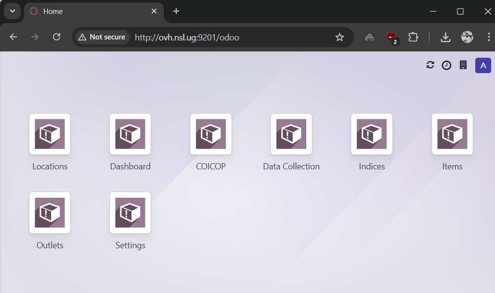
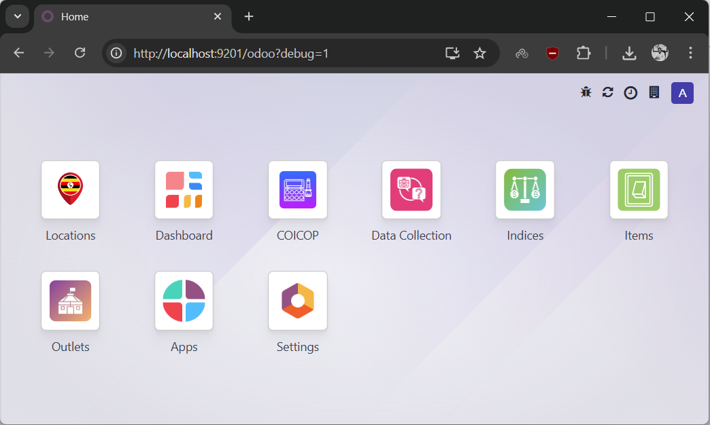

# Linux Server Installation

This guide walks you through installing HCPI on a Linux server (Ubuntu 20.04 LTS or later recommended).

## Step 1: Update System Packages

```bash
sudo apt update
sudo apt upgrade -y
```

## Step 2: Install System Dependencies

Install required packages:

```bash
sudo apt install -y git python3 python3-pip python3-dev python3-venv \
    postgresql postgresql-contrib libpq-dev \
    build-essential libssl-dev libffi-dev libxml2-dev libxslt1-dev \
    zlib1g-dev libjpeg-dev libsasl2-dev libldap2-dev \
    node-less npm wkhtmltopdf unzip
```

## Step 3: Configure PostgreSQL

Create a PostgreSQL user and database for HCPI:

```bash
sudo -u postgres createuser -s hcpi
sudo -u postgres psql -c "ALTER USER hcpi WITH PASSWORD 'your_secure_password';"
sudo -u postgres createdb -O hcpi hcpi
```

!!! tip "Database User"
    We're using `hcpi` as both the database name and username. You can choose different names, but make sure to update the configuration file accordingly.

## Step 4: Create Directory Structure

Create the HCPI directory structure:

```bash
sudo mkdir -p /opt/hcpi
sudo chown $USER:$USER /opt/hcpi
cd /opt/hcpi
```

!!! warning "Custom Installation Path"
    If you choose a different path than `/opt/hcpi`, you'll need to update the paths in the configuration file (see Step 7).

## Step 5: Set Up HCPI Files

By now you should already have `hcpi-files.zip` — produced from your country's server using the [extraction guide](../extraction/linux-export.md). See [Prerequisites → Get the Required Files](../getting-started/prerequisites.md#get-the-required-files) if you don't. Copy it into `/opt/hcpi` (e.g. via `scp` from your Windows machine, or `wget` from wherever you've staged it), then:

```bash
cd /opt/hcpi

# Extract HCPI files (contains conf and custom folders)
unzip hcpi-files.zip

# Create log directory
mkdir -p log
```

Then clone Odoo 18. It's a separate command so you can re-run it on its own if the download fails partway (this can take a few minutes depending on your connection):

```bash
cd /opt/hcpi
git clone --depth 1 --branch 18.0 https://github.com/odoo/odoo.git
```

??? note "No export files? Download Uganda's test files instead"
    For testing or reference only, you can pull the Uganda test set:

    ```bash
    cd /opt/hcpi
    wget http://statistics.ubos.org/hcpishare/hcpi-files.zip
    unzip hcpi-files.zip
    mkdir -p log
    ```

    Then run the separate `git clone` command above.

After this, you should have:

```
/opt/hcpi/
├── conf/          # Configuration files (from hcpi-files.zip)
├── custom/        # Contains HCPI module (from hcpi-files.zip)
│   └── HCPI/      # Main HCPI module
├── log/           # Log files (created)
├── odoo/          # Odoo 18 codebase (cloned)
└── venv/          # Python virtual environment (will create next)
```

## Step 6: Set Up Python Virtual Environment

Create and activate the virtual environment:

```bash
cd /opt/hcpi
python3 -m venv venv
source venv/bin/activate
```

Install Python dependencies:

```bash
pip install --upgrade pip
pip install wheel
pip install numpy
pip install -r odoo/requirements.txt
```

!!! info "NumPy Requirement"
    NumPy is required for HCPI but not included in Odoo's default requirements, so we install it separately.

## Step 7: Configure Odoo

The configuration file is already provided in `/opt/hcpi/conf/hcpi.conf`. Review and update the following settings:

```bash
nano /opt/hcpi/conf/hcpi.conf
```

**Key settings to update:**

```ini
[options]
; Change this to a strong password for database management operations
admin_passwd = your_strong_admin_password

; Set this to match the PostgreSQL password from Step 3
db_password = your_secure_password

; UPDATE THESE PATHS if you installed to a different location than /opt/hcpi
addons_path = /opt/hcpi/odoo/addons,/opt/hcpi/custom/HCPI
logfile = /opt/hcpi/log/hcpi.log

; Change this if port 9201 is already in use
http_port = 9201
```

!!! warning "Important"
    - **admin_passwd**: Used for database management operations - choose a strong password
    - **db_password**: Must match the PostgreSQL password you created in Step 3
    - **Paths**: Update `addons_path` and `logfile` if you chose a different installation location
    - **http_port**: Change if port 9201 is already in use

## Step 8: Restore Data (Optional)

You have two choices here. A full restore brings in another instance's data and attachments. An empty start gives you a clean HCPI with just the modules.

### Option A: Start with Sample Data

A full restore has **two parts** that must both be done: the database, then the filestore. Missing the filestore will leave broken attachments and images in the restored instance.

#### A1: Restore the database

Use the `hcpi.dump` file produced by the [extraction guide](../extraction/linux-export.md) (PostgreSQL custom format):

```bash
cd /opt/hcpi
pg_restore -U hcpi -d hcpi --no-owner --no-privileges -j 4 hcpi.dump
```

Enter the `hcpi` user password when prompted.

??? note "If you have a plain `hcpi.sql` file instead (legacy)"
    Older exports sometimes ship as a plain SQL file inside `hcpi-db.zip`. The current extraction flow does **not** produce this — if you have one, it's from an older process.

    ```bash
    cd /opt/hcpi
    unzip hcpi-db.zip
    psql -U hcpi -d hcpi -f hcpi.sql
    ```

#### A2: Restore the filestore

The filestore goes under the user that will run HCPI — typically **your current user**, not the source server's user. Odoo looks for it under the current user's HOME at `~/.local/share/Odoo/filestore/<db_name>`.

```bash
mkdir -p ~/.local/share/Odoo/filestore
cd ~/.local/share/Odoo/filestore
unzip /path/to/hcpi-filestore.zip
```

After unzipping, confirm the folder name matches your `db_name`:

```bash
ls ~/.local/share/Odoo/filestore
# Should show: hcpi   (or whatever db_name you're using)
```

!!! warning "If you run HCPI as a different system user (e.g. via systemd)"
    Odoo reads the filestore from the HOME of the user the Odoo process runs as. If you configured a dedicated `hcpi` system user in the service file later, move the filestore there:

    ```bash
    sudo mkdir -p ~hcpi/.local/share/Odoo/filestore
    sudo mv ~/.local/share/Odoo/filestore/hcpi ~hcpi/.local/share/Odoo/filestore/
    sudo chown -R hcpi:hcpi ~hcpi/.local
    ```

### Option B: Start with Empty Instance

If you want a fresh HCPI instance with just the modules, skip this step entirely — no database restore, no filestore. Odoo will initialize an empty database when you first run it with the `-i HCPI` flag (see Step 9).

## Step 9: Start HCPI

Start Odoo with the HCPI configuration:

```bash
cd /opt/hcpi
source venv/bin/activate
python odoo/odoo-bin -c conf/hcpi.conf
```

!!! tip "First Run with Empty Database"
    If you didn't restore a database, use this command on first run to install the HCPI module and generate assets:
    ```bash
    python odoo/odoo-bin -c conf/hcpi.conf -u all --dev=all
    ```
    This ensures icons and assets are properly generated on the first run.

!!! info "First-Time Startup"
    The first time you start HCPI, it may take a few minutes to initialize. Be patient during the initial load. Subsequent starts will be much faster.

## Step 10: Configure Firewall

Allow access to the HCPI port (default 9201):

```bash
sudo ufw allow 9201/tcp
```

## Step 11: Access HCPI

Open your web browser and navigate to:

```
http://localhost:9201
```

Or if accessing remotely:

```
http://your_server_ip:9201
```

!!! warning "First Load May Be Slow"
    The first time you access HCPI, the page may take 30-60 seconds to load as it initializes the interface. After this initial load, performance should be normal.

### Fix Missing Icons

If you notice missing icons in the interface after installation:

**Before (missing icons):**



**To fix:**

1. Click on your username in the top right
2. Go to **Settings** → **Activate the developer mode**
3. Then go to **Settings** → **Technical** → **User Interface** → **Regenerate Assets Bundles**
4. Refresh the page

**After (icons restored):**



Alternatively, you can restart HCPI with the asset regeneration flag:

```bash
python odoo/odoo-bin -c conf/hcpi.conf -u all --dev=all
```

## Running as a Service (Recommended for Production)

Create a systemd service file for automatic startup:

```bash
sudo nano /etc/systemd/system/hcpi.service
```

Add the following content (update paths if you used a different location):

```ini
[Unit]
Description=HCPI Odoo Service
After=network.target postgresql.service

[Service]
Type=simple
User=your_username
Group=your_username
WorkingDirectory=/opt/hcpi
Environment="PATH=/opt/hcpi/venv/bin"
ExecStart=/opt/hcpi/venv/bin/python /opt/hcpi/odoo/odoo-bin -c /opt/hcpi/conf/hcpi.conf
Restart=on-failure
RestartSec=10

[Install]
WantedBy=multi-user.target
```

Replace `your_username` with your actual username, then enable and start the service:

```bash
sudo systemctl daemon-reload
sudo systemctl enable hcpi
sudo systemctl start hcpi
```

Check service status:

```bash
sudo systemctl status hcpi
```

## Troubleshooting

### Check Logs

View HCPI logs:

```bash
tail -f /opt/hcpi/log/hcpi.log
```

### Service Issues

If the service fails to start:

```bash
sudo systemctl status hcpi
sudo journalctl -u hcpi -n 50
```

### Port Already in Use

If port 9201 is already in use, change it in `/opt/hcpi/conf/hcpi.conf`:

```ini
http_port = 9202
```

Then restart the service or HCPI.

### Database Connection Issues

If you get database connection errors, verify:

```bash
# Check PostgreSQL is running
sudo systemctl status postgresql

# Test database connection
psql -U hcpi -d hcpi -c "SELECT version();"
```

### Module Not Found

If HCPI module is not found, verify the addons_path in the config file points to the correct location:

```ini
addons_path = /opt/hcpi/odoo/addons,/opt/hcpi/custom/HCPI
```

## Next Steps

- Set up SSL/TLS with nginx or Apache as a reverse proxy
- Configure regular database backups
- Review the [Odoo 18 documentation](https://www.odoo.com/documentation/18.0/) for advanced configuration
- Configure user accounts and permissions in HCPI
