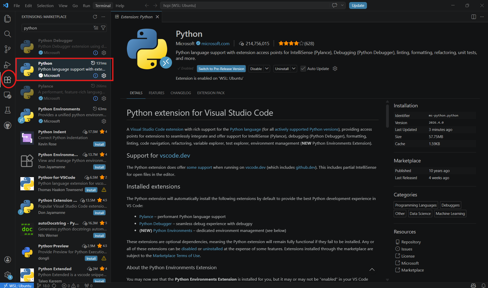
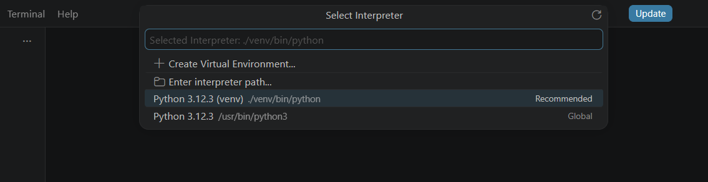

# Windows WSL Installation

This guide shows you how to install HCPI on Windows using WSL (Windows Subsystem for Linux). This setup provides a Linux environment on Windows and is recommended for development work.

!!! info "What is WSL?"
    WSL allows you to run a Linux distribution alongside your Windows installation. This provides better compatibility with Odoo and HCPI compared to native Windows installation.

## Step 1: Install WSL and Ubuntu

First, check what you already have. Open **PowerShell** (regular, not Administrator) and run:

```powershell
wsl -l -v
```

You'll see one of three outcomes:

- **"Windows Subsystem for Linux has no installed distributions"** — you need a fresh install. Continue with **Option A** below.
- **A list that includes `Ubuntu`** — you already have Ubuntu. Skip to **Option C**.
- **A list with other distros but no Ubuntu** (e.g. only `docker-desktop`) — Ubuntu isn't installed yet. Use **Option B**.

### Option A: Fresh install (no WSL yet)

Open **PowerShell as Administrator** and run:

```powershell
wsl --install
```

This enables WSL and installs Ubuntu by default. **Restart your computer when prompted.** After the restart, continue with Step 2.

### Option B: WSL is installed but Ubuntu isn't

From a regular PowerShell:

```powershell
wsl --install -d Ubuntu
```

No restart needed. Continue with Step 2.

### Option C: Ubuntu is already installed

Skip Step 2. Go straight to Step 3 and open your existing Ubuntu terminal (Start menu → Ubuntu, or run `wsl` from PowerShell).

## Step 2: Set Up Ubuntu (first-time only)

After installing Ubuntu, launch it:

- **If Ubuntu didn't open automatically after the install/restart**, open the Start menu, search for **Ubuntu**, and click it. Or run `wsl` from PowerShell.
- On **first launch**, Ubuntu takes a minute to finish setting itself up, then prompts you to create a Linux username and password.

!!! warning "Remember Your Password"
    You'll need this password for sudo commands inside WSL. Make sure to remember it — resetting it later is a hassle.

!!! tip "The Linux username is separate from your Windows username"
    They can be the same if you want, but they don't have to be. Lowercase only, no spaces.

## Step 3: Update Ubuntu Packages

In your Ubuntu terminal:

```bash
sudo apt update
sudo apt upgrade -y
```

## Step 4: Install System Dependencies

Install required packages:

```bash
sudo apt install -y git python3 python3-pip python3-dev python3-venv \
    postgresql postgresql-contrib libpq-dev \
    build-essential libssl-dev libffi-dev libxml2-dev libxslt1-dev \
    zlib1g-dev libjpeg-dev libsasl2-dev libldap2-dev \
    node-less npm wkhtmltopdf unzip
```

## Step 5: Configure PostgreSQL

Modern WSL2 installations have systemd enabled by default — this guide assumes that's the case. Quick sanity check:

```bash
systemctl is-system-running
```

You should see `running` or `degraded` (either is fine). If not, expand the block below before continuing.

??? note "If systemd isn't active"
    The fix depends on whether you're on WSL2 (where systemd can be enabled) or WSL1 (where it can't). Check your version first.

    **Find out which WSL version you're on.** Open **PowerShell on Windows** (not inside WSL) and run:

    ```powershell
    wsl -l -v
    ```

    You'll see a table. Look at the `VERSION` column for your distribution — it will be either `1` or `2`.

    **If you're on WSL2**, turn systemd on. Back in your WSL terminal:

    ```bash
    sudo nano /etc/wsl.conf
    ```

    Add:

    ```ini
    [boot]
    systemd=true
    ```

    Save (`Ctrl+X`, `Y`, `Enter`), then from **PowerShell on Windows**:

    ```powershell
    wsl --shutdown
    ```

    Reopen your WSL terminal and re-run `systemctl is-system-running`. You should now see `running` or `degraded`, and you can continue with the golden path below.

    **If you're on WSL1**, systemd isn't available — period. Upgrading to WSL2 is recommended (from PowerShell: `wsl --set-version <DistroName> 2`). If you want to stay on WSL1, skip the `systemctl` commands below and use the legacy form instead:

    ```bash
    sudo service postgresql start
    echo "sudo service postgresql start" >> ~/.bashrc
    ```

    Downside of the WSL1 route: each new terminal window will prompt for your sudo password, and auto-start is tied to shell open (not VM boot).

### Start PostgreSQL and enable auto-start

```bash
sudo systemctl enable --now postgresql
systemctl status postgresql
```

`status` should show `active (running)`. From now on, PostgreSQL starts automatically every time WSL boots.

!!! info "Does PostgreSQL run when WSL is closed?"
    No. WSL2 shuts down its VM shortly after the last terminal window closes, and everything inside — including PostgreSQL — stops with it. When you next open a WSL terminal, systemd starts the VM back up and PostgreSQL comes online a second or two later. This is fine for development use.

### Create the database user and database

```bash
sudo -u postgres createuser -s hcpi
sudo -u postgres psql -c "ALTER USER hcpi WITH PASSWORD 'your_secure_password';"
sudo -u postgres createdb -O hcpi hcpi
```

!!! tip "Database User"
    We're using `hcpi` as both the database name and username. You can choose different names, but update the configuration file accordingly.

## Step 6: Create Directory Structure

Create the HCPI directory:

```bash
sudo mkdir -p /opt/hcpi
sudo chown $USER:$USER /opt/hcpi
cd /opt/hcpi
```

!!! warning "Custom Installation Path"
    If you choose a different path than `/opt/hcpi`, you'll need to update the paths in the configuration file (see Step 10).

## Step 7: Transfer and Set Up Files

This step assumes your exported files are at `C:\hcpi-export\` on Windows — the default location used by the [extraction guide](../extraction/linux-export.md). WSL can read your Windows drives through `/mnt/c/...`, so the Windows path `C:\hcpi-export\` is `/mnt/c/hcpi-export/` when viewed from WSL.

!!! tip "Files in a different folder?"
    Replace `/mnt/c/hcpi-export` in the commands below with the WSL path to wherever you put them. For example, `C:\Users\YourName\Downloads\` becomes `/mnt/c/Users/YourName/Downloads/`.

Copying to `/opt/hcpi` (on WSL's Linux filesystem) is a one-time cost that gives you much faster performance than running HCPI off `/mnt/c/` would.

```bash
cd /opt/hcpi

# Copy and extract HCPI files (contains conf and custom folders)
cp /mnt/c/hcpi-export/hcpi-files.zip .
unzip hcpi-files.zip

# Create log directory
mkdir -p log
```

Then clone Odoo 18. It's a separate command so you can re-run it on its own if the download fails partway (this can take a few minutes depending on your connection):

```bash
cd /opt/hcpi
git clone --depth 1 --branch 18.0 https://github.com/odoo/odoo.git
```

??? note "No export files? Download Uganda's test files instead"
    If you don't have your own country's export, you can pull the Uganda test set directly in WSL:

    ```bash
    cd /opt/hcpi
    wget http://https://statistics.ubos.org/shares/d/z_M6k4Jya_lxN6lWX5Wz_w/hcpi-files.zip
    unzip hcpi-files.zip
    mkdir -p log
    ```

    Then run the separate `git clone` command above.

Check the layout with `ls`. You should see:

```
/opt/hcpi/
├── conf/          # Configuration files (from hcpi-files.zip)
├── custom/        # Contains HCPI module (from hcpi-files.zip)
│   └── HCPI/      # Main HCPI module
├── log/           # Log files (created)
├── odoo/          # Odoo 18 codebase (cloned)
└── venv/          # Python virtual environment (will create next)
```

## Step 8: Set Up Python Virtual Environment

Create and activate the virtual environment:

```bash
cd /opt/hcpi
python3 -m venv venv
source venv/bin/activate
```

Install Python dependencies:

```bash
pip install --upgrade pip
pip install wheel
pip install numpy
pip install -r odoo/requirements.txt
```

!!! info "NumPy Requirement"
    NumPy is required for HCPI but not included in Odoo's default requirements, so we install it separately.

## Step 9: Open the Project in an IDE

Editing `hcpi.conf` with `nano` works, but for the rest of your HCPI work — exploring modules, debugging, following the code — a proper IDE is much nicer. Set it up once now so the next step (and everything after) is easier. VS Code is the recommended choice for WSL; PyCharm is a fine alternative if you already know it.

### VS Code (recommended for WSL)

VS Code is fully free and has first-class WSL integration. All features are available without a paid tier.

1. **Install VS Code** on Windows if you don't have it: [code.visualstudio.com](https://code.visualstudio.com/). During installation, **tick "Add to PATH"** — this is what lets you launch VS Code with `code .` from any terminal. It's on by default but worth confirming.
2. **Install the WSL extension**: in VS Code, open the Extensions panel (Ctrl+Shift+X), search for *WSL*, install the one by Microsoft.
3. **Open the project from inside WSL**. In your WSL terminal, run:

    ```bash
    cd /opt/hcpi
    code .
    ```

    On first run this installs the VS Code Server into your WSL. A VS Code window will open, connected to WSL (you'll see "WSL: Ubuntu" in the bottom-left status bar).

4. **Install the Python extension** in this VS Code window. Open the Extensions panel (Ctrl+Shift+X — circled in red below), search for "Python", and install the Microsoft one (highlighted in the rectangle):

    

5. **Select the interpreter**. Press `Ctrl+Shift+P` and start typing `Python: Select Interpreter`:

    

    In the list you'll typically see your venv shown as something like `./venv/bin/python3` (a relative path) — pick that:

    

    If you don't see it, click "Enter interpreter path..." and paste the full path:

    ```
    /opt/hcpi/venv/bin/python3
    ```

6. **Install the Odoo extension.** In Extensions, search for *Odoo* and install the one published by **Odoo S.A.** (the official one — free, despite the publisher name). It adds autocomplete and navigation for Odoo models, fields, XML views, and decorators — very useful once you start editing modules. You won't need it to just run HCPI, but you'll want it before making your first code change.

??? note "`code .` returns 'command not found'"
    Means WSL can't find the VS Code launcher. Try these in order:

    1. **Close and reopen your WSL terminal.** VS Code's WSL integration installs `code` into your `$PATH`, but only new shells pick it up.
    2. **Restart WSL entirely.** From PowerShell on Windows: `wsl --shutdown`, then reopen your WSL terminal.
    3. **Confirm VS Code on Windows can run `code`.** Open PowerShell (not WSL) and run `code --version`. If that also says "not recognized", VS Code wasn't added to your Windows PATH — reinstall VS Code and make sure "Add to PATH" is ticked, or manually add `C:\Users\<you>\AppData\Local\Programs\Microsoft VS Code\bin` to the PATH environment variable.
    4. **As a fallback, connect to WSL from VS Code directly** (no terminal needed):
        - Open VS Code from the Start menu on Windows.
        - Make sure the **WSL extension** is installed (Extensions panel → search "WSL" → install the Microsoft one).
        - Press `Ctrl+Shift+P` → run **WSL: Connect to WSL**. VS Code will reload into a WSL-connected window; you'll see **WSL: Ubuntu** in the bottom-left status bar.
        - Then **File → Open Folder** → navigate to `/opt/hcpi` and open it.
        - Continue with step 4 above (install Python extension, select interpreter).

??? note "PyCharm alternative"
    PyCharm Community is free, but several features useful for Odoo work are **Professional-only** (~$99/year):

    - Remote development over SSH or WSL
    - Database tools
    - HTTP client
    - Docker integration

    If you're working inside WSL and using Community edition, you'll be operating over the `\\wsl$\Ubuntu\...` network path, which is slower than VS Code's WSL Remote approach. For that reason **VS Code is a better fit for WSL workflows**, but PyCharm is still a fine choice if you already know it.

    1. **Install PyCharm** (Community or Professional): [jetbrains.com/pycharm](https://www.jetbrains.com/pycharm/).
    2. **Open the project**: File → Open → navigate to `\\wsl$\Ubuntu\opt\hcpi` (Windows File Explorer can browse WSL paths, and so can PyCharm).
    3. **Add the interpreter**: File → Settings → Project: hcpi → Python Interpreter → Add → *WSL* (Professional only) or *System Interpreter* → browse to `\\wsl$\Ubuntu\opt\hcpi\venv\bin\python3`.

## Step 10: Configure Odoo

The configuration file is already provided in `/opt/hcpi/conf/hcpi.conf`. Review and update the following settings:

```bash
nano /opt/hcpi/conf/hcpi.conf
```

**Key settings to update:**

```ini
[options]
; Force TCP + password auth instead of the Unix-socket peer auth the exported
; config assumes. Without these your WSL Linux username won't match "hcpi"
; and connection will fail.
db_host = localhost
db_port = 5432

; Set this to match the PostgreSQL password from Step 5
db_password = your_secure_password

; UPDATE THESE PATHS if you installed to a different location than /opt/hcpi
addons_path = /opt/hcpi/odoo/addons,/opt/hcpi/custom/HCPI
logfile = /opt/hcpi/log/hcpi.log

; Change this if port 9201 is already in use
http_port = 9201
```

!!! warning "Important"
    - **db_host / db_port**: The exported config has `db_host = False` which relies on Unix-socket peer authentication (matching Linux username to PostgreSQL username). In your WSL you're logged in as yourself, not as `hcpi`, so peer auth fails. Setting `db_host = localhost` forces TCP + password auth, which works.
    - **db_password**: Must match the PostgreSQL password you created in Step 5
    - **Paths**: Update `addons_path` and `logfile` if you chose a different installation location
    - **http_port**: Change if port 9201 is already in use

!!! info "About `admin_passwd`"
    The config from your export already has an `admin_passwd` set — that's the master password for database management operations (backup, restore, drop via Odoo's database manager UI). Leave it as-is to keep using the source instance's value, or change it here if you want a different one. It's not related to user logins, just DB-level admin actions.

!!! tip "Save in Nano"
    Press `Ctrl+X`, then `Y`, then `Enter` to save and exit nano.

## Step 11: Set Up Your Data

Pick one of the two options below. Both are equally valid — your choice depends on whether you have an existing database to clone from, or want to start fresh.

### Option A: Restore from an existing instance (recommended if you have the files)

A full restore has **two parts** that must both be done: the database, then the filestore. Missing the filestore will leave broken attachments and images.

#### A1: Restore the database

Use the `hcpi.dump` file produced by the [extraction guide](../extraction/linux-export.md) (PostgreSQL custom format):

```bash
cd /opt/hcpi
cp /mnt/c/hcpi-export/hcpi.dump .
pg_restore -U hcpi -h localhost -d hcpi --no-owner --no-privileges -j 4 hcpi.dump
```

Enter the `hcpi` user password when prompted.

??? note "Re-running the restore / getting 'already exists' errors"
    `pg_restore` expects an empty database. If you're running it a second time — because the first run failed partway, or you want to start over — you'll see errors like `relation "..." already exists` or `constraint "..." already exists`, because the tables from the first attempt are still there.

    The cleanest fix is to drop the database and recreate it empty, then re-run the restore:

    **Step 1.** Make sure Odoo isn't running (it holds a DB connection that blocks the drop). If Odoo is running in another WSL terminal, stop it with `Ctrl+C`.

    **Step 2.** Drop the old database:

    ```bash
    sudo -u postgres dropdb hcpi
    ```

    **Step 3.** Recreate it empty, owned by the hcpi user:

    ```bash
    sudo -u postgres createdb -O hcpi hcpi
    ```

    **Step 4.** Re-run the restore (same command as above):

    ```bash
    cd /opt/hcpi
    pg_restore -U hcpi -h localhost -d hcpi --no-owner --no-privileges -j 4 hcpi.dump
    ```

    If `dropdb` fails with "database is being accessed by other users", some process still has a connection. Close any running `psql` sessions, stop Odoo, and try again. As a last resort, force-close other connections:

    ```bash
    sudo -u postgres psql -c "SELECT pg_terminate_backend(pid) FROM pg_stat_activity WHERE datname='hcpi' AND pid <> pg_backend_pid();"
    sudo -u postgres dropdb hcpi
    ```

    After the fresh restore, also **wipe the filestore** if you're re-importing from scratch — otherwise you'll have orphan files from the previous attempt mixed in with the new ones:

    ```bash
    rm -rf ~/.local/share/Odoo/filestore/hcpi
    ```

    Then re-do the A2 filestore step below.

!!! info "Why `-h localhost`?"
    Without it, `pg_restore` uses the Unix socket and PostgreSQL tries peer authentication — matching your Linux username to a PostgreSQL user of the same name. Since you're logged in as yourself (not `hcpi`), that fails. `-h localhost` forces TCP, which uses password auth instead.

??? note "If you have a plain `hcpi.sql` file instead (legacy)"
    Older exports sometimes ship as a plain SQL file inside `hcpi-db.zip`. The current extraction flow does **not** produce this — if you have one, it's from an older process.

    ```bash
    cd /opt/hcpi
    cp /mnt/c/hcpi-export/hcpi-db.zip .
    unzip hcpi-db.zip
    psql -U hcpi -d hcpi -f hcpi.sql
    ```

#### A2: Restore the filestore

The filestore goes under your WSL user's HOME, at `~/.local/share/Odoo/filestore/<db_name>`:

```bash
mkdir -p ~/.local/share/Odoo/filestore
cd ~/.local/share/Odoo/filestore
unzip /mnt/c/hcpi-export/hcpi-filestore.zip
```

After unzipping, confirm the folder name matches your `db_name`:

```bash
ls ~/.local/share/Odoo/filestore
# Should show: hcpi   (or whatever db_name you're using)
```

!!! info "Why HOME?"
    Odoo looks for the filestore under the HOME of the user running the Odoo process. In WSL development setups that's typically the same user you're logged in as.

### Option B: Start with Empty Instance

Skip this step entirely — no database restore, no filestore. Odoo will initialize a fresh empty database when you first run it with the `-i HCPI` flag (see Step 12).

## Step 12: Start HCPI

Make sure PostgreSQL is running:

```bash
sudo service postgresql start
```

Start HCPI:

```bash
cd /opt/hcpi
source venv/bin/activate
```

### Start HCPI

??? note "Used empty database (Option B)? Do this once first"
    If you skipped the restore step and are starting with an empty database, you need a one-time initialization command to install the HCPI module into the fresh DB:

    ```bash
    python odoo/odoo-bin -c conf/hcpi.conf -i HCPI --stop-after-init
    ```

    `-i HCPI` tells Odoo to *install* the HCPI module (and its dependencies) into the empty database. `--stop-after-init` runs the install and exits cleanly. Run this once, then start HCPI normally with the command below.


Whether you restored from a dump (Step 11 Option A) or will start fresh in a moment, the command to run HCPI is the same:

```bash
python odoo/odoo-bin -c conf/hcpi.conf
```

Every time you want to run HCPI going forward, use this command.

!!! info "First-time startup can take 1–3 minutes"
    On the very first run, Odoo builds asset bundles (JS/CSS) and populates base data. Subsequent starts are much faster. Watch the log (or the terminal output) for the line `HTTP service (werkzeug) running on ... port 9201`, that's your cue it's ready.

??? note "`odoo-bin` fails to start — common causes"
    Read the last lines of the traceback carefully; the error type below usually tells you what's wrong.

    **`psycopg2.OperationalError: ... Peer authentication failed for user "hcpi"`**
    The config still has `db_host = False` or is missing the db_host line entirely. Re-check Step 10: `db_host = localhost`, `db_port = 5432`, `db_password` matches what you set in Step 5.

    **`psycopg2.OperationalError: FATAL: password authentication failed for user "hcpi"`**
    `db_password` in `hcpi.conf` doesn't match what PostgreSQL has. Reset it:

    ```bash
    sudo -u postgres psql -c "ALTER USER hcpi WITH PASSWORD 'your_secure_password';"
    ```

    Then make sure the exact same string is in `hcpi.conf`.

    **`could not connect to server: No such file or directory`**
    PostgreSQL isn't running. `sudo systemctl start postgresql`.

    **`ImportError: No module named '...'` / `ModuleNotFoundError`**
    Your venv isn't active, or a dependency didn't install. Activate the venv (`source venv/bin/activate` — your prompt should show `(venv)`) and re-run `pip install -r odoo/requirements.txt`.

    **`FileNotFoundError: ... HCPI`** or the module isn't found
    The `addons_path` in `hcpi.conf` is wrong. Confirm the path points to the folder that *contains* `HCPI/`, not to `HCPI/` itself: `/opt/hcpi/custom/HCPI` means "look for modules inside HCPI/", which usually isn't what you want if you have multiple modules. Correct form: `/opt/hcpi/odoo/addons,/opt/hcpi/custom/HCPI` works because `custom/HCPI` is the folder containing the individual module subfolders.

    **`queue_job` not found**
    The exported config has `server_wide_modules = base,web,queue_job`. Confirm `/opt/hcpi/custom/HCPI/queue_job/` exists. If missing, the export is incomplete — re-run the extraction guide. As a workaround, you can temporarily remove `queue_job` from `server_wide_modules` in `hcpi.conf`.

    **Port 9201 already in use**
    Another Odoo instance is running, or something else is on that port. Find it: `sudo ss -ltnp | grep 9201`. Kill it or change `http_port` in `hcpi.conf`.

## Step 13: Access HCPI

Open your Windows web browser and navigate to:

```
http://localhost:9201
```

!!! warning "First Load May Be Slow"
    The first time you access HCPI, the page may take 30-60 seconds to load as it initializes the interface. After this initial load, performance should be normal.

### Sign in

**If you restored from an existing database** (Option A in Step 11): sign in with the same credentials you use on the source instance's web version — the users from the source DB are in your restored copy.

**If you started empty** (Option B in Step 11): Odoo created a default admin user. Log in with:

- **Email**: `admin`
- **Password**: `admin`

Then immediately change it: top-right user menu → **My Profile** → **Preferences** → change the password. For a real deployment, also create a second admin-level user (Settings → Users & Companies → Users) so you don't get locked out if you lose the admin account.

### Fix Missing Icons

If you notice missing icons in the interface after installation:

**Before (missing icons):**


**To fix:**

1. Click on your username in the top right
2. Go to **Settings** → **Activate the developer mode**
3. Then go to **Settings** → **Technical** → **User Interface** → **Regenerate Assets Bundles**
4. Refresh the page

**After (icons restored):**


Alternatively, you can restart HCPI with the asset regeneration flag:

```bash
python odoo/odoo-bin -c conf/hcpi.conf -u all --dev=all
```

## Creating a Startup Script (Optional)

Create a convenient startup script:

```bash
nano ~/start-hcpi.sh
```

Add:

```bash
#!/bin/bash
sudo service postgresql start
cd /opt/hcpi
source venv/bin/activate
python odoo/odoo-bin -c conf/hcpi.conf
```

Make it executable:

```bash
chmod +x ~/start-hcpi.sh
```

Now you can start HCPI with:

```bash
~/start-hcpi.sh
```

## Accessing Files Between Windows and WSL

### From WSL to Windows
Windows drives are mounted at `/mnt/`:
- C: drive → `/mnt/c/`
- D: drive → `/mnt/d/`

### From Windows to WSL
Open File Explorer and enter in the address bar:
```
\\wsl$\Ubuntu\opt\hcpi
```

## Troubleshooting

### PostgreSQL Won't Start

```bash
sudo service postgresql status
sudo service postgresql restart
```

### Database Connection Issues

Test the database connection:

```bash
psql -U hcpi -d hcpi -c "SELECT version();"
```

### Permission Issues

If you get permission errors:

```bash
sudo chown -R $USER:$USER /opt/hcpi
```

### Python Module Errors

Ensure you're in the virtual environment:

```bash
source /opt/hcpi/venv/bin/activate
```

### Port Already in Use

Change the port in `/opt/hcpi/conf/hcpi.conf`:

```ini
http_port = 9202
```

### Module Not Found

Verify the addons_path in the config file:

```ini
addons_path = /opt/hcpi/odoo/addons,/opt/hcpi/custom/HCPI
```

### Check Logs

```bash
tail -f /opt/hcpi/log/hcpi.log
```

## Performance Tips

- Place project files in the Linux filesystem (`/opt/hcpi`) rather than accessing Windows filesystem (`/mnt/c/`) for better performance
- Allocate more RAM to WSL if needed by creating `.wslconfig` in your Windows user directory

## Next Steps

HCPI is now running on your machine. To start working with the code:

➡️ **[Understanding the Codebase](../understanding-the-codebase/index.md)** — a map of what's where and how to find things.

Then:

➡️ **[Making Your First Edits](../first-edits/index.md)** — small, safe changes to build confidence.

For further reading and setup:

- Review the [Odoo 18 documentation](https://www.odoo.com/documentation/18.0/) for configuration options
- Configure HCPI modules for your organization's needs
- Configure user accounts and permissions in HCPI
