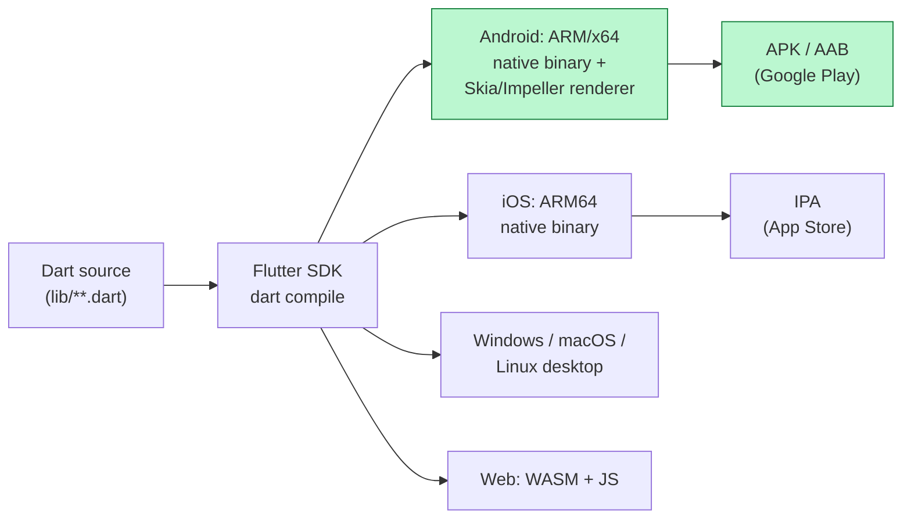
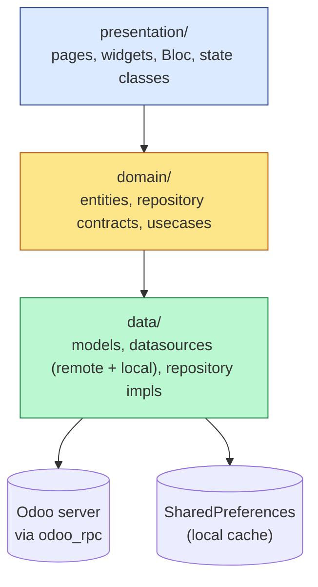
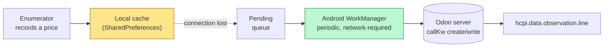
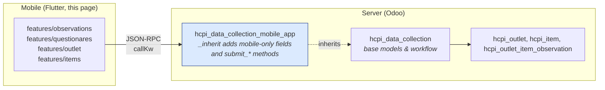

# The HCPI Mobile App (Flutter)

Field price collection happens almost entirely on a phone or tablet — enumerators visit outlets, record prices for each item, attach photos, and sync everything back to the country's HCPI Odoo server. That phone-side software is the **HCPI Mobile App**, a Flutter application that lives in **its own git repository**, separate from the Odoo codebase the rest of this documentation describes.

This page is the orientation for that repository: what Flutter is, how the app is laid out, how it talks to the server, and where to look when you need to change something.

!!! info "Where the code lives"
    The Flutter project is in its own repository under the EAC GitHub organisation:
    **<https://github.com/East-African-Community-HCPI/hcpi_mobile_app>** — browse the code, open issues, or send pull requests there.

    To clone it locally:

    ```bash
    git clone git@github.com:East-African-Community-HCPI/hcpi_mobile_app.git
    ```

    The pubspec identifies the package as `hcpi` ("HCPI Data Collection App"). The companion server-side module is [`hcpi_data_collection_mobile_app`](../modules/data-collection.md#hcpi_data_collection_mobile_app--the-flutter-surface), which lives in the main HCPI Odoo repo — it exposes the fields and methods the Flutter app calls. The two repos are versioned and deployed independently but must agree on field names and method signatures.

    Access to the EAC GitHub organisation is required to clone. If you do not yet have it, follow [Git Remotes (EAC)](../getting-started/git-remotes.md) to set up your SSH key and request access.

## 1. What is Flutter, briefly

Flutter is Google's UI toolkit for building **one codebase that runs as a native app on Android, iOS, Windows, macOS, Linux, and the web**. You write in **Dart**; Flutter compiles that Dart down to platform-native code and ships a small runtime that draws the UI directly with the device's GPU.

The compilation pipeline looks like this:



Two things to keep in mind from that picture:

- **It is real native code**, not a WebView wrapper. Flutter doesn't render through HTML — it draws its own pixels via the **Impeller / Skia** engine bundled with the app. That's why a Flutter app feels as smooth as a hand-written native app, even though one developer wrote it once.
- **Each platform is a separate build target.** The Dart source is shared; the output is not. Producing an Android `.aab` and an iOS `.ipa` requires two separate builds (and, for iOS, a Mac and an Apple Developer account).

## 2. Why we only ship for Android (for now)

If you list the project root, every Flutter target is there:

```
hcpi_mobile_app/
├── android/    ← currently the only platform we ship
├── ios/        ← scaffolding exists, not actively built
├── linux/      ← unused
├── macos/      ← unused
├── web/        ← unused
└── windows/    ← unused
```

The reasons we have stuck to Android:

| Reason | Detail |
|---|---|
| Field hardware | Every NSO that has adopted HCPI hands out Android tablets to enumerators — iOS deployments haven't been requested. |
| iOS toolchain cost | Building and shipping for iOS requires a Mac in the build pipeline and a paid Apple Developer Programme membership for the publishing organisation. Neither has been provisioned. |
| Permission and lifecycle parity | The offline-sync model the app relies on (Android `WorkManager`, exact alarms, foreground persistence) maps cleanly onto Android; iOS has a much stricter background-execution model that would require redesigning the sync loop. |

The codebase **does not technically block** building for iOS or desktop — the Dart layer is platform-agnostic, the `ios/` scaffold is checked in, and most of the dependencies (`odoo_rpc`, `shared_preferences`, `geolocator`, `image_picker`) are cross-platform. If a country office asks for iOS in future, the work is: get a Mac in CI, register the bundle ID, port the background-sync code to use `BackgroundFetch` or equivalent, and re-test. None of the app's business logic would change.

## 3. The repository, folder by folder

Top level inside `hcpi_mobile_app/`:

| Folder / file | Purpose |
|---|---|
| [`lib/`](#4-inside-lib-architecture) | All Dart source. This is where 99% of work happens. |
| [`android/`](#5-the-android-side-build-config-permissions) | Android-specific config, manifest, keystore wiring, native code (none custom right now). |
| `ios/`, `macos/`, `windows/`, `linux/`, `web/` | Other platform scaffolds. Generated by `flutter create`, untouched. |
| [`assets/`](#6-assets) | Bundled images, SVGs, custom fonts (Poppins). |
| `pubspec.yaml` | Dart's `package.json` — declares dependencies, version, fonts, assets. |
| `pubspec.lock` | Resolved exact versions. Check in. |
| `analysis_options.yaml` | Lint rules. |
| `test/` | Unit / widget tests (sparse). |

## 4. Inside `lib/` — architecture

The Dart source is organised around **feature-first clean architecture**. `main.dart` is the entry point and is deliberately tiny — it boots dependency injection, the background-sync worker, the local Odoo client, and then hands off to `MaterialApp`.

```
lib/
├── main.dart                 ← entrypoint: DI, work-manager, Odoo client
├── core/                     ← cross-cutting code
│   ├── app routes/             route definitions
│   ├── dependency_injector/    get_it container
│   ├── error/                  Failure / Exception classes
│   ├── multiProviders/         BlocProvider wiring
│   └── util/
│       ├── globals/
│       │   ├── odooClient/     ← OdooClientStorage (auth + persistence)
│       │   └── variables/      ← country domains, model names
│       ├── helpers/            work_manager.dart, location_helper.dart, …
│       ├── network/            HTTP overrides (e.g. dev cert trust)
│       └── widgets/            shared widgets
└── features/                 ← one folder per business capability
    ├── auth/
    ├── home/
    ├── internetConnection/
    ├── items/
    ├── observations/         ← the prices themselves
    ├── outlet/
    ├── priceCodes/           ← "out of stock", "seasonal", …
    ├── questionareItems/
    ├── questionares/         ← the data-collection "visit"
    ├── settings/
    ├── units_of_measure/
    └── work_manager_sync/    ← offline → server reconciliation
```

Each feature follows the same three-layer split:



| Layer | What lives there | Why it's separate |
|---|---|---|
| **presentation/** | Flutter widgets, screen pages, **Bloc** state machines (`flutter_bloc`), state classes. | The only layer that knows about Flutter. Swapping UI doesn't touch business logic. |
| **domain/** | Pure-Dart entities, `abstract class` repositories, `UseCase` classes. No Flutter, no HTTP. | This is the contract. Both UI and tests depend on it; nothing in it depends on them. |
| **data/** | Concrete implementations: `*RemoteDatasource` (talks to Odoo), `*LocalDatasource` (reads/writes `SharedPreferences`), `*RepositoryImpl` (chooses online vs. cached). | The only place that knows about RPC formats, JSON, and SharedPreferences keys. |

State management is **Bloc** (`flutter_bloc` + `bloc`). Dependency injection is **`get_it`**, initialised once at startup in `core/dependency_injector/`. UI navigation is centralised in `core/app routes/routes.dart`.

## 5. Talking to the server — auth, sessions, Odoo RPC

The mobile app does **not** invoke any custom HTTP controller. It talks to the same Odoo JSON-RPC endpoint (`/web/dataset/call_kw/`) that the web client uses, via the **`odoo_rpc` Dart package** (`^0.5.2` in `pubspec.yaml`).

### Picking the country (the domain dropdown)

When the app first launches, the user selects a country:

```dart
final DOMAIN_MAPPINGS = {
  'Uganda':            { 'domain': UG_DOMAIN,      'country': 'ug' },
  'Kenya':             { 'domain': KE_DOMAIN,      'country': 'ke' },
  'Tanzania Mainland': { 'domain': TZ_DOMAIN,      'country': 'tz', 'db': 'hcpi18' },
  'Zanzibar':          { 'domain': ZAR_DOMAIN,     'country': 'zar' },
  'Rwanda':            { 'domain': RW_DOMAIN,      'country': 'rw' },
  'Burundi':           { 'domain': BI_DOMAIN,      'country': 'bi' },
  'South sudan':       { 'domain': SS_DOMAIN,      'country': 'ss' },
  'Kenya Test':        { 'domain': KE_TEST_DOMAIN, 'country': 'ke',  'db': 'hcpitest' },
  'Dev Test':          { 'domain': DEV_DOMAIN,     'country': 'dev' },
};
```

The mapping lives in `lib/core/util/globals/variables/database_constants.dart`. Picking a country sets `DATABASE_URL`, optionally overrides the database name, and populates the per-country model variables that the rest of the app references:

```dart
ctry_data_collection             = "hcpi.data.collection";
ctry_collection_product_price_line = "hcpi.data.collection.line";
ctry_observed_price_line         = "hcpi.data.observation.line";
ctry_outlet_model                = "hcpi.outlet";
ctry_outlet_new_model            = "hcpi.outlet.new";
ctry_item_new_model              = "hcpi.item.new";
```

Note that today every country resolves to the **same** generic `hcpi.*` model names — confirmation that the cross-country harmonisation described in [Country Variants](country-variants.md) is live in the mobile layer too.

### Sign-in and session persistence

Sign-in is handled in `OdooClientStorage` (`lib/core/util/globals/odooClient/odoo_client_storage.dart`):

```dart
static Future<List> getSignInClientAndSession(login, password) async {
  final domainMap = getDomainMapping(DATABASE_URL);
  final client    = OdooClient(DATABASE_URL);
  var session     = await client.authenticate(
      domainMap['db'] ?? DATABASE_NAME, login, password);
  return [client, session];
}
```

After authentication, the **session and base URL are serialised to `SharedPreferences`** so the app can resurrect the client on the next launch without re-prompting. That allows offline work — the persisted session is enough to read cached data, queue new observations locally, and submit later when the device is online again.

### The call pattern — `callKw`

Every server interaction uses the same shape. Example from the observations remote datasource:

```dart
var response = await client.callKw({
  'model':  ctry_observed_price_line,    // "hcpi.data.observation.line"
  'method': 'create',
  'args':   [ /* values */ ],
  'kwargs': {},
});
```

This translates to a JSON-RPC POST to `/web/dataset/call_kw/<model>/<method>` on the country's Odoo. **There is no custom controller in between** — the app is, from the server's point of view, just another authenticated client invoking ORM methods.

## 6. Endpoints — the models and methods the app touches

Below is the complete surface as of this writing, extracted from the `*_remote_datasource.dart` / `*_remote_ds.dart` files. Each row is a server-side model the app reads or writes, with the methods invoked.

| Feature folder | Model | Methods called | Purpose |
|---|---|---|---|
| `auth/` | `res.users` | `write` | Edit profile fields. |
| `auth/` | `res.company` | `search_read` | Company name, logo, registry, currency — branded UI. |
| `auth/` | `res.config.settings` | `get_display_location_settings` | Geofence radius / popup mode for the location helper. |
| `items/` | `hcpi.elementary.aggregate` | `search_read` | EA lookup for new-item registration. |
| `items/` | `hcpi.item` | `search_read` | Existing catalog. |
| `items/` | `hcpi.item.new` (`ctry_item_new_model`) | `search_read`, `create`, `write`, `action_confirm` | Mobile-side new-item submission queue (supervisor approves on server). |
| `outlet/` | `hcpi.outlet` (`ctry_outlet_model`) | `search_read` | List existing outlets the collector is assigned to. |
| `outlet/` | `hcpi.outlet.new` (`ctry_outlet_new_model`) | `search_read`, `create`, `write`, `action_confirm` | Mobile-side new-outlet submission queue. |
| `outlet/` | `hcpi.outlet.type` | `search_read` | Outlet type dropdown. |
| `outlet/` | `hcpi.consumption.segment` | `search_read` | Basket (e.g. *Kampala Urban*) for the outlet. |
| `outlet/` | contact model (related) | `search_read` | Outlet contacts. |
| `questionares/` | `hcpi.data.collection` (`ctry_data_collection`) | `search_read`, `validate`, `standardize` | Questionnaires + state-machine transitions. |
| `questionareItems/` | `hcpi.data.collection.line` (`ctry_collection_product_price_line`) | `search_read` | The priced items inside a questionnaire. |
| `observations/` | `hcpi.data.observation.line` (`ctry_observed_price_line`) | `search_read`, `create`, `write`, `unlink` | The actual price entries (multiple per line). |
| `priceCodes/` | `hcpi.price.collection.code` | `search_read` | *Out of stock*, *seasonal*, *new product* exception codes. |
| `units_of_measure/` | `hcpi.uoo` | `search_read` | Units of observation (kg, L, piece, …). |

Two observations from that table:

- The app uses the **standard ORM methods** (`search_read`, `create`, `write`, `unlink`) almost everywhere — no bespoke RPC. The only custom server-side methods called are `validate`, `standardize` (state-machine transitions on `hcpi.data.collection`), `action_confirm` (on the *.new mobile-submission queues), and `get_display_location_settings`.
- The `*.new` suffix models (`hcpi.item.new`, `hcpi.outlet.new`) are mobile-submission staging tables. A collector can create a new item or outlet from the field; the record sits in the staging model until a supervisor confirms it on the web UI, after which it is promoted into the real `hcpi.item` / `hcpi.outlet`. This is what `action_confirm` triggers.

## 7. Offline-first — local cache and background sync

A collector standing in a roadside market with no signal still has to be able to file prices. The app handles this in two layers.

### Local cache via `SharedPreferences`

Every feature has a `*LocalDataSource` alongside its remote one. Lookups (outlets, items, UoOs, price codes) are mirrored into `SharedPreferences` on login. New observations the user creates while offline are written **locally first** and queued for submission.

### `WorkManager` periodic sync (Android)

The app registers a periodic Android `WorkManager` task at boot, in `lib/core/util/helpers/work_manager.dart`:

```dart
await Workmanager().initialize(callbackDispatcher, isInDebugMode: false);
await Workmanager().registerPeriodicTask(
  "periodic-task-identifier",
  "syncToServer",
  constraints: Constraints(networkType: NetworkType.connected),
);
```

When the OS deems the device idle and connected, `callbackDispatcher` instantiates a `WorkManagerSynchronizer` (in `features/work_manager_sync/data/synchronizer.dart`) and calls `submit_observations()`. That walks the local queue, replays each pending observation against the server via `callKw('create' / 'write' / 'unlink')`, and clears the queue on success.

The `connectivity_plus` + `internet_connection_checker` packages drive an `InternetConnectionBloc` that also re-triggers `initialiseUserClient()` when connectivity returns — so a session that expired while offline is refreshed as soon as the device is back online.



!!! tip "iOS implication"
    The `Platform.isIOS` check in `initialise_work_manager` is a no-op — iOS does not have an equivalent always-on background scheduler. Any future iOS port would need a different sync strategy (e.g. `BackgroundFetch` for opportunistic syncs, plus an explicit "sync now" button in-app).

## 8. Native plugins and platform permissions

The app uses several Flutter packages that wrap platform-native APIs. The ones that change app behaviour most:

| Package | What it gives us | Permissions added |
|---|---|---|
| `geolocator` | Tags each questionnaire with GPS coordinates for outlet-visit verification. | `ACCESS_FINE_LOCATION`, `ACCESS_COARSE_LOCATION` |
| `image_picker` | Snap photos of items / shop fronts. | (camera prompt at use-time) |
| `connectivity_plus`, `internet_connection_checker` | Detect online/offline state. | `INTERNET` |
| `flutter_local_notifications` | Local reminders (e.g. "you have unsynced observations"). | `SCHEDULE_EXACT_ALARM`, boot-completed receiver |
| `workmanager` | Periodic background sync. | `INTERNET`, exact-alarm |
| `in_app_update` | Prompt the user to update via Play Store when a new version is published. | (Play Store managed) |
| `package_info_plus`, `device_info_plus` | Diagnostics — app version, device model — sent with bug reports. | none |
| `url_launcher` | Open phone numbers / SMS / web links. | tel/sms/web `<intent-filter>` queries |
| `google_sign_in` | (Wired but currently unused for production sign-in.) | none on Android |

The Android-side declarations live in `android/app/src/main/AndroidManifest.xml`. The build configuration (`android/app/build.gradle`) sets:

```groovy
namespace      = "eac.hcpi.app"
applicationId  = "eac.hcpi.app"
compileSdk     = 36
targetSdk      = 35
multiDexEnabled true
```

`eac.hcpi.app` is the Play Store package identifier. Signing reads from a `key.properties` file at the Android module root — that file is **not** checked in and must exist on whatever machine produces the release `.aab`.

## 9. Map of mobile app ↔ server module

The Flutter app and the server-side Odoo module [`hcpi_data_collection_mobile_app`](../modules/data-collection.md#hcpi_data_collection_mobile_app--the-flutter-surface) are the two halves of the same feature. They are versioned and deployed independently but must agree on field names and method signatures.



When you add a field that the mobile app needs to send, you add it on the **server** side via `_inherit` in `hcpi_data_collection_mobile_app`, and on the **mobile** side in the matching `*Model` class (a Dart data class with `fromJson` / `toJson`). Forget either half and the field silently vanishes.

## 10. Build, sign, and release

The release flow today is:

1. Bump the version in `pubspec.yaml` (`version: 1.0.X+X`). The first number is `versionName` (Android), the second is `versionCode`.
2. Ensure `android/key.properties` is in place on the build machine, with the release keystore it points at. Neither file is checked into git.
3. `flutter build appbundle --release` produces `build/app/outputs/bundle/release/app-release.aab`.
4. Upload the `.aab` to the Google Play Console.
5. The app's own `in_app_update` plugin prompts existing users to update once the release rolls out.

!!! warning "Play Store account migration (open issue 5.4)"
    The Google Play listing is currently under Kola's developer account, not under EAC. Moving it to an EAC-controlled Play account is on the reported-issues backlog ([5.4 in the issues report](../../issues-report.md)). When that happens, the package identifier `eac.hcpi.app` stays the same — only the publishing account changes — so existing installs keep updating without user intervention, provided the migration uses Google Play's [App transfer](https://support.google.com/googleplay/android-developer/answer/6230247) flow rather than a new listing.

## 11. Where to look to change something

| You want to… | Open |
|---|---|
| Add a new country to the dropdown | `lib/core/util/globals/variables/database_constants.dart` — add an entry to `DOMAIN_MAPPINGS` and a currency to `getCurrencyToUse`. |
| Change which Odoo URL each country points at | Same file — the `*_DOMAIN` constants at the top. |
| Add a new field to the new-outlet form | `features/outlet/data/models/` (Dart side, `fromJson` / `toJson`), then `features/outlet/presentation/` for the form widget. Server-side, extend `hcpi.outlet.new`. |
| Add a new screen | New folder under `features/`, mirror the existing `data` / `domain` / `presentation` shape, register routes in `core/app routes/routes.dart`, register Blocs in `core/multiProviders/multiProvider.dart`. |
| Change what the background sync does | `features/work_manager_sync/data/synchronizer.dart` (the work) + `core/util/helpers/work_manager.dart` (the scheduling). |
| Change the geofence / location prompt | Server side — `res.config.settings.get_display_location_settings` controls `display_location_pop_up` and `distance_diff`. The mobile side reads it in `OdooClientStorage.saveLocationSettings`. |
| Investigate a sync failure | `features/work_manager_sync/data/synchronizer.dart` — wrap `submit_observations()` in `try/catch` and log to a persistent file via `path_provider`. The current code only `print`s. |
| Add a new RPC call | A new `*RemoteDatasource` method using `client.callKw({...})`. Wire it into the matching repository and usecase. |
| Bump the minimum Android version | `android/app/build.gradle` — `minSdkVersion` defaults to `flutter.minSdkVersion`; override there. |
| Ship for iOS | Get a Mac, register `eac.hcpi.app` with Apple, replace `WorkManager` calls with `BackgroundFetch`, re-test offline scenarios. |

## 12. Common gotchas

- **`get_it` registrations are order-sensitive.** If a `Bloc` you added to `multiProvider.dart` can't be resolved at startup, check that its dependencies are registered earlier in `core/dependency_injector/__init__.dart`.
- **`shared_preferences` is your "database".** There is no SQLite layer. Large lists (items, outlets) are serialised to JSON strings under keys. If you add a feature that caches a lot, watch the preference size — Android imposes a soft cap before performance degrades.
- **`SharedPreferences.getString` returns `null` on first run.** The robust pattern in this codebase is `_readAuthDataSafely` in `OdooClientStorage` — wrap reads in `try / catch` and return defaults; don't bang (`!`) the result.
- **Session expiry while offline is silent.** The session JSON in `SharedPreferences` may be unauthenticated by the time you sync. The connectivity bloc re-runs `initialiseUserClient` on reconnect, but a long-stale session needs the user to re-enter their password.
- **`WorkManager` is Android-only.** The `Platform.isIOS` guard short-circuits initialisation on iOS — meaning the iOS scaffold is unusable for production today even though it builds.
- **Two model variables per country (`*_model` and `*_new_model`).** The `*.new` models are mobile-submission staging tables; the plain models are the canonical post-approval records. Confusing one for the other is a common cause of "my new outlet didn't show up on the dashboard" tickets.

## Further reading

- **Repository:** [github.com/East-African-Community-HCPI/hcpi_mobile_app](https://github.com/East-African-Community-HCPI/hcpi_mobile_app) — source, issues, releases
- **Server-side counterpart:** [Data Collection module — `hcpi_data_collection_mobile_app`](../modules/data-collection.md#hcpi_data_collection_mobile_app--the-flutter-surface)
- **What the data eventually becomes:** [How the Calculations Work](../concepts/how-calculations-work.md)
- **Country differences (which the mobile app reads):** [Country Variants](country-variants.md)
- **External:** [Flutter documentation](https://docs.flutter.dev), [`odoo_rpc` package](https://pub.dev/packages/odoo_rpc)
