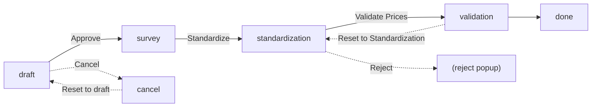
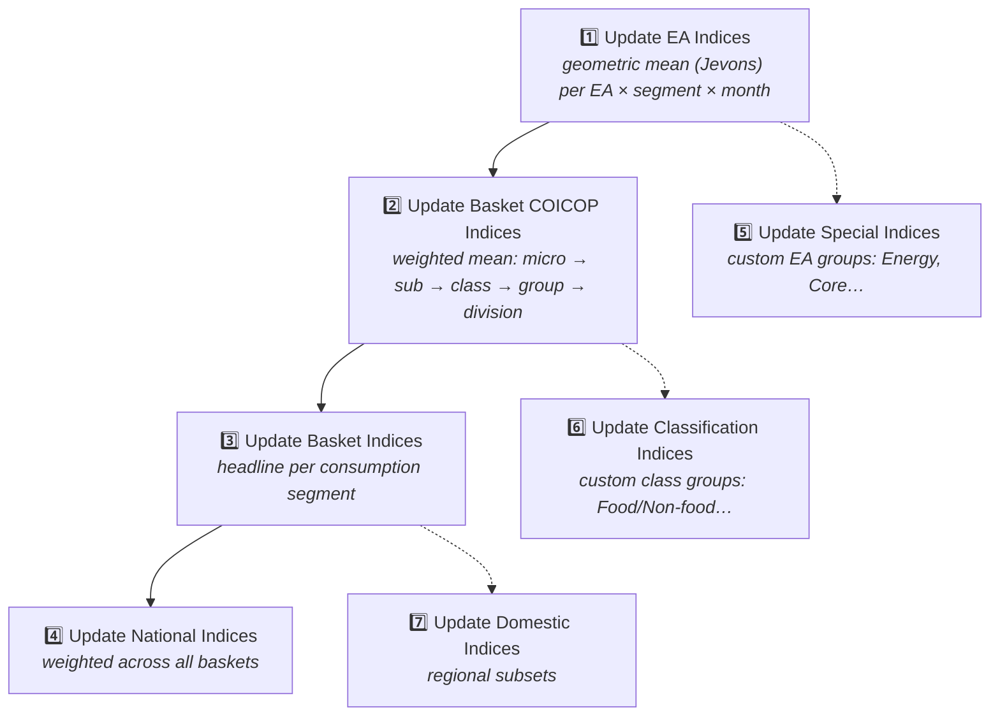

# Using the System — A UI Walkthrough

This page is the **literal click-by-click guide** to running HCPI in the Odoo web interface: which menu, which form, which button label, in what order. If [How the Calculations Work](concepts/how-calculations-work.md) tells you *what* the system computes, this page tells you *how to make it compute*.

It assumes a fresh, empty HCPI instance. If you already have a running country instance, skip Phase 0 (setup) and jump to [Phase 2 — Collecting prices (monthly)](#phase-2-collecting-prices-monthly).

## The HCPI navbar at a glance

When you log into Odoo and open HCPI, the top navbar shows these root menus, left to right (in sequence order):

| Menu | What it's for |
|---|---|
| **Dashboard** | Landing page with key index summaries |
| **Data Collection** | Field questionnaires (`hcpi.data.collection`) and validation batches (`hcpi.data.validation`) |
| **Indices** | Index results, **the seven computation wizards** (numbered 1️⃣–7️⃣), and computation history |
| **COICOP** | The product-classification ladder: Divisions → Groups → Classes → Sub Classes → Micro Classes → Elementary Aggregates |
| **Items** | The item catalogue and Units of Measure |
| **Outlets** | Outlets, outlet items, observations, consumption segments, and EA weights |

The monthly working rhythm only really uses **Data Collection** and **Indices**. The other three menus are mostly one-time configuration that you barely touch after the first setup.

---

## Phase 0 — One-time setup (a fresh instance)

You only do this once when standing up a new country instance. Order matters: each step depends on the one above.

### 0.1 Build the COICOP classification ladder

Menu: **COICOP**

Build it top-down, in this exact order — each level points to its parent:

1. **COICOP → Divisions** → click **New** → fill in COICOP code and name (e.g. *"01 — Food and non-alcoholic beverages"*) → **Save**.
2. **COICOP → Groups** → New → pick the Division → Save.
3. **COICOP → Classes** → New → pick the Group → Save.
4. **COICOP → Sub Classes** → New → pick the Class → Save.
5. **COICOP → Micro Classes** → New → pick the Sub Class → Save.
6. **COICOP → Elementary Aggregates** → New → pick the Micro Class → Save. *(This is the rung where the index actually starts being computed — see [Stage 4 of the calculations page](concepts/how-calculations-work.md#stage-4-the-elementary-aggregate-index-the-foundation).)*

### 0.2 Define units of measure and items

Menu: **Items**

1. **Items → Units of Measure** → New → for each unit you'll record prices in (kg, litre, piece, …).
2. **Items → Items** → New. For each item: name (e.g. *"White bread loaf, 500 g"*), link to its **Elementary Aggregate** and **Micro Class**, set the **standard quantity** and **standard unit**.

The link to the Elementary Aggregate is the chain that, weeks later, will route the item's price up the right COICOP ladder.

### 0.3 Define consumption segments (the "baskets")

Menu: **Outlets → Consumption Segments**

Click **New**, name the segment (e.g. *"Kampala Urban"*, *"Rural North"*), save. You will create one segment per population stratum — each one has its own weights and produces its own basket-level index.

### 0.4 Define outlets

Menu: **Outlets**

1. **Outlets → Configuration → Outlet Types** → New → categories like *"Supermarket"*, *"Open market stall"*, *"Pharmacy"*. *(Reusable across all outlets.)*
2. **Outlets → Outlets** → New → name, address, **outlet type**, and the **consumption segment** it belongs to.
3. Open the outlet form. In the header, click **"Add Items"** (header button, visible to users in the *Outlet Manager* group). This opens a wizard that lets you link multiple items at once to this outlet and record each item's **base price** (the reference-period price each long-term relative is measured against).

After this, each link is an `hcpi.outlet.item` record — visible under **Outlets → Outlet Items**.

### 0.5 Enter EA weights

Menu: **Outlets → Elementary Aggregate Weights**

Click **New**, pick an **Elementary Aggregate** and a **Consumption Segment**, type in the **weight** (the household expenditure share of that EA in that basket), save. Repeat for every (EA × segment) pair.

!!! warning "Weights are the only thing stored manually above the EA"
    Every higher-level weight (class, group, division, basket) is the **sum** of the EA weights beneath it — computed automatically. You never enter a class weight or a division weight by hand.

---

## Phase 1 — Designing the monthly questionnaire (optional helpers)

Before enumerators go into the field, you may want to bulk-generate or assign their questionnaires instead of clicking "New" on every single one.

Menu: **Data Collection**

### 1.1 Bulk Questionnaires wizard

Menu: **Data Collection → Bulk Questionnaires** — opens a wizard (model `bulk.questionnaire.wizard`) in a popup.

What you do on the form:

1. Pick the **Consumption Segment** (field `consumption_segment_id`).
2. Pick the **Collection Date** for the month (field `collection_date`).
3. Click **"Create Questionnaires"** (the green highlighted button at the bottom of the popup; calls `create_bulk_questionnaire`). It creates one `hcpi.data.collection` draft per outlet in that segment for that date.
4. Or click **"Discard"** to close without creating anything.

The created records appear under **Data Collection → Data Collection**, all in `draft` state, ready for an enumerator.

### 1.2 Assign Questionnaires wizard

Menu: **Data Collection → Assign Questionnaires** — opens a wizard (model `assign.questionnaire.wizard`) that bulk-assigns the **Data Collector** and **Supervisor** users on a selection of questionnaires.

What you do on the form:

1. In the **Data Collections** field (many2many tags, field `data_collection_ids`), pick the questionnaires you want to assign.
2. Pick the **Data Collector** (field `data_collector_id`) and **Data Supervisor** (field `data_supervisor_id`).
3. Click **"Assign Questionnaires"** (the green button at the bottom of the popup; calls `assign_bulk_questionnaire`). It writes those two users onto every selected `hcpi.data.collection` record.
4. Or click **"Discard"** to cancel.

If your team creates questionnaires one at a time on phones (via the mobile app in `hcpi_data_collection_mobile_app`), you can skip both wizards.

---

## Phase 2 — Collecting prices (monthly)

This is what enumerators (and supervisors) do at the start of every month — turning field visits into draft observations.

Menu: **Data Collection → Data Collection**

The record you're editing is an `hcpi.data.collection` — one questionnaire per outlet per month. It walks through five states, and the header of the form shows different buttons depending on which state it's in. Here is the complete journey, click-by-click.

### 2.1 Create the questionnaire (state: none → `draft`)

1. Click **New** in the list-view toolbar (top-left).
2. Fill in the form: **Outlet**, **Collection Date**, **Consumption Segment**, **Data Collector** (the enumerator), and **Supervisor**.
3. Click the **cloud / save** icon (top-left of the form) to save.

The record is now in `draft` state — visible at the top of the form's status bar.

### 2.2 Enter the price lines (still `draft`)

Open the **"Observations"** tab (the notebook tab near the bottom of the form). For each item priced at this outlet today, add a line:

- **Outlet Item** — picks one of the items linked to this outlet (and through it, the COICOP classification and the base price).
- **Observed Price** — what the enumerator saw on the shelf or shop counter.
- **Observed Quantity** and **Unit** — only set if different from the item's standard.

Each line is an `hcpi.data.collection.line` record. Save the form again after adding lines.

### 2.3 Approve the questionnaire (`draft` → `survey`)

Click the green **"Approve"** button in the form header (visible only while state = `draft`; calls `approve()`).

This marks the questionnaire as ready for collection / further processing. The status bar advances to `survey`. If you decided not to use it, click the red **"Cancel"** button (also visible only while state = `draft`; calls `cancel()`) — that moves it to `cancel` state, where the **"Reset to draft"** button can revive it.

### 2.4 Standardize the prices (`survey` → `standardization`)

Click the green **"Standardize"** button in the header (visible only while state = `survey`; calls `standardize()`).

This walks every collection line and computes the **standard price** — the observed price normalised to the item's standard quantity and unit. So if the enumerator priced rice as *"4,200 UGX per 1.5 kg"* but the item's standard is *"per 1 kg"*, this step produces `standard_price = 2,800 UGX/kg`. That `standard_price` is what every later calculation uses.

The status bar advances to `standardization`.

### 2.5 Validate the prices (`standardization` → `validation`)

Click the green **"Validate Prices"** button in the header (visible only while state = `standardization`; calls `validate()`).

This is the handover from the *collection* workflow into the *validation* workflow. It groups every collection line for the same **consumption segment × month** into a single `hcpi.data.validation` batch — the record you'll open in [Phase 3](#phase-3-validating-prices-the-tukey-check) to run the Tukey outlier check.

The status bar advances to `validation`, and a new stat button **"Validations"** appears at the top-right of the form (calls `action_open_validation()`) — click it to jump straight to the validation batch this questionnaire belongs to.

If something is wrong with the standardized prices, two recovery buttons exist:

- **"Reject"** (red, visible only while state = `standardization`; calls `action_open_reject_view()`) — opens a popup to enter a reject reason, and routes the questionnaire back for re-collection.
- **"Reset to Standardization"** (visible only while state = `validation`; calls `reset_to_standardize()`) — lets a supervisor walk it back to the standardization step to re-enter prices.

### 2.6 The full button reference for the data collection form

| Button | Visible when state = | Method called | What it does |
|---|---|---|---|
| **"Approve"** | `draft` | `approve()` | `draft` → `survey` |
| **"Cancel"** | `draft` | `cancel()` | `draft` → `cancel` |
| **"Standardize"** | `survey` | `standardize()` | Computes `standard_price` on every line; `survey` → `standardization` |
| **"Validate Prices"** | `standardization` | `validate()` | Groups lines into a `hcpi.data.validation`; `standardization` → `validation` |
| **"Reject"** | `standardization` | `action_open_reject_view()` | Opens reject-reason popup; routes back to standardization |
| **"Reset to Standardization"** | `validation` | `reset_to_standardize()` | `validation` → `standardization` |
| **"Reset to draft"** | `cancel` | `reset_to_draft()` | `cancel` → `draft` |
| **Stat button: "Validations"** | always (if any exist) | `action_open_validation()` | Jumps to the related `hcpi.data.validation` batch |



---

## Phase 3 — Validating prices (the Tukey check)

This is what supervisors do to clean the month's prices before they become permanent observations. One `hcpi.data.validation` record covers one **consumption segment × month** and walks through four states. Each header button drives one transition.

Menu: **Data Collection → Data Validations**

Open a validation record (the one auto-created when an enumerator clicked **"Validate Prices"** in Phase 2). State is `draft`.

### 3.1 Run the Tukey outlier check (`draft` → `validation`)

Click the green **"Validate"** button in the form header (visible only while state = `draft`; calls `action_validate()`).

Behind the scenes this runs **`run_turkey()`** — the Tukey outlier algorithm described in [Stage 3 of the calculations page](concepts/how-calculations-work.md#stage-3-cleaning-the-data). It computes a price relative for every line, trims the top and bottom 5%, then flags anything outside `gen_avg ± 2.5·(side_avg − gen_avg)` as `is_outlier`.

The status bar advances to `validation`. Now you can see what got flagged:

- **Stat button "Outliers"** at the top-right of the form (calls `action_open_outliers()`) — opens a filtered list of every line where `is_outlier = True`. Walk this list and untick `is_outlier` on any price you believe is real (e.g. a genuine market shock).

### 3.2 Run the inlier check (`validation` → `validate_inliers`)

Click the green **"Validate Inliers"** button in the header (visible only while state = `validation`; calls `action_validate_inliers()`).

This runs **`validate_inliers()`** — it flags any line where the price has been *identical for the last 12 months*. Persistent non-movement is just as suspicious as a wild jump (often it's a copy-pasted or forgotten price). The flag goes onto `is_inlier`.

The status bar advances to `validate_inliers`. Now review:

- **Stat button "Inliers"** at the top-right (calls `action_open_inliers()`) — opens a filtered list of every line where `is_inlier = True`. Walk it and untick `is_inlier` on any price you believe is genuinely unchanged (e.g. a regulated tariff).

### 3.3 Fill the gaps with imputation (`validate_inliers` → `imputation` → `done`)

Click the green **"Impute"** button in the header (visible only while state = `validate_inliers`; calls `action_impute()`).

Before it runs, Odoo pops up a **confirmation dialog** with the exact text: *"Please note that this action confirms the current inliers and outliers before proceeding with imputation."* Click **OK** to proceed. This is the point of no return — after this, the outlier/inlier flags are locked in.

Imputation then climbs the COICOP ladder to fill any missing prices, calling in turn:

1. `impute_with_prices()` — same product in another outlet
2. `impute_with_ea()` — other items in the same elementary aggregate
3. `impute_with_micro_class()` → `_sub_class()` → `_class()` → … — keeps climbing until it finds usable data

Each imputed line is marked `is_imputed` with the method recorded for audit.

The status bar advances through `imputation` to `done`. The surviving prices are now permanent `hcpi.outlet.item.observation` records — visible under **Outlets → Price Data**.

Review what was imputed via the **stat button "Imputed Prices"** at the top-right (calls `action_open_imputed()`).

### 3.4 Recovery — `"Reset to Draft"`

If you discover a problem after starting validation, the **"Reset to Draft"** button (visible whenever state ≠ `draft`; calls `reset_to_draft()`) walks the record all the way back to `draft` so you can re-run **"Validate"** from scratch.

### 3.5 The full button reference for the data validation form

| Button | Visible when state = | Method called | What it does |
|---|---|---|---|
| **"Validate"** | `draft` | `action_validate()` → runs `run_turkey()` | Tukey outlier check; flags `is_outlier`; `draft` → `validation` |
| **"Validate Inliers"** | `validation` | `action_validate_inliers()` → runs `validate_inliers()` | Flags `is_inlier` on 12-month-flat prices; `validation` → `validate_inliers` |
| **"Impute"** | `validate_inliers` | `action_impute()` → runs the `impute_with_*()` ladder | Fills gaps; confirms outliers/inliers; `validate_inliers` → `imputation` → `done` |
| **"Reset to Draft"** | any non-draft state | `reset_to_draft()` | Restarts the validation workflow |
| **Stat button: "Inliers"** | always | `action_open_inliers()` | Filtered list of flagged inliers |
| **Stat button: "Outliers"** | always | `action_open_outliers()` | Filtered list of flagged outliers |
| **Stat button: "Imputed Prices"** | always | `action_open_imputed()` | Filtered list of imputed lines |

```mermaid
flowchart LR
    D["draft"] -->|"Validate"<br/>(run_turkey)| V["validation"]
    V -->|"Validate Inliers"<br/>(validate_inliers)| VI["validate_inliers"]
    VI -->|"Impute"<br/>(impute_with_*)| I["imputation"]
    I --> DN["done"]
    V -.->|"Reset to Draft"| D
    VI -.->|"Reset to Draft"| D
    I -.->|"Reset to Draft"| D
```

---

## Phase 4 — Computing the indices (monthly, strictly in order)

This is the heart of the monthly cycle. Each wizard is its own menu entry under **Indices → Computations**, numbered 1️⃣ to 7️⃣. **Each one reads from the level below — do not skip ahead.**

Menu: **Indices → Computations**



### 4.1 What every "Update X Indices" wizard looks like

All seven wizards share the **same form pattern**. Knowing it once means you know all of them. When you click any of the seven menu items, Odoo opens a fresh wizard record (a new draft) with this layout:

- **Form title** at the top (e.g. *"Update Elementary Aggregate Indices"*, *"Update Basket COICOP Indices"*, *"Basket Index Update"*, *"National Index Update"*).
- **Status bar** at the top of the form: `draft` → `processing` → `done` (the EA wizard also shows `cancelling`, `cancelled`, `failed`).
- **No filter fields.** You will not see a date-range picker or a segment selector — these wizards process **all** data the database has. The only field shown is **"Last Update"** (`create_date`).
- **A blue info alert in the form body** while state = `draft`: *"Ready to update X Indices — Click 'Start Update' button above to begin processing."*
- **An orange warning alert** if the zero-price gate has flagged contaminated months — see [4.4](#44-the-zero-price-safety-gate) below.
- **Two header buttons** (depending on state):
    - **"Start Update"** — green, highlighted, visible only while state = `draft` *and* the zero-price gate is satisfied.
    - **"Cancel"** — grey, visible only while state = `processing` (and **only on the EA, Special, and Classification wizards** — see [4.3](#43-cancellation-which-wizards-can-be-stopped)).

The flow on each form is therefore identical:

1. Open the menu entry → fresh wizard record appears in `draft`.
2. Read the *"Ready to update…"* alert. Verify there is no zero-price warning.
3. Click **"Start Update"** (top of the form).
4. The form stays open and the alert turns orange: *"⏳ Update in Progress…"* with a live progress bar, status message, "Records: X / Y" counter, and "Estimated Time Remaining". The EA wizard also notes: *"💡 Detailed nested progress is available in the system tray (top-right corner). Click the notification icon to see real-time updates."*
5. When the computation finishes, the alert turns green: *"✓ Update Completed Successfully! All X indices have been updated."* with a *"Total Records Processed"* count. State is now `done`.
6. If something goes wrong, the alert turns red: *"✗ Update Failed"* with a `progress_message` and the line *"Please check the logs for more information."* State is `failed`.

### 4.2 The seven wizards — menu, model, button method

| Step | Menu (under **Indices → Computations**) | Wizard model | "Start Update" calls | Form title |
|---|---|---|---|---|
| 1️⃣ | **Update EA Indices** | `hcpi.ea.index.update` | `action_update_ea_indices()` | *"Update Elementary Aggregate Indices"* |
| 2️⃣ | **Update Basket COICOP Indices** | `hcpi.basket.coicop.index.update` | `action_update_basket_coicop_indices()` | *"Update Basket COICOP Indices"* |
| 3️⃣ | **Update Basket Indices** | `hcpi.basket.index.update` | `action_update_basket_indices()` | *"Basket Index Update"* |
| 4️⃣ | **Update National Indices** | `hcpi.national.index.update` | `action_update_national_indices()` | *"National Index Update"* |
| 5️⃣ | **Update Special Indices** | `hcpi.special.index.update` | `action_update_special_indices()` | *"Special Index Update"* |
| 6️⃣ | **Update Classification Indices** | `hcpi.classification.index.update` | `action_update_classification_indices()` | *"Classification Index Update"* |
| 7️⃣ | **Update Domestic Indices** | `hcpi.domestic.index.update` | `action_update_domestic_indices()` | *"Domestic Index Update"* |

Steps **1–4 are mandatory** and must run in that order. Steps **5–7 are optional side cuts** that can run any time after their dependency:

- **5️⃣ Special** needs EA indices (step 1).
- **6️⃣ Classification** needs Basket COICOP indices (step 2).
- **7️⃣ Domestic** needs Basket indices (step 3).

### 4.3 Cancellation — which wizards can be stopped?

Only **three** of the seven wizards expose a **"Cancel"** button (visible only while state = `processing`; calls `action_cancel()` with the confirmation prompt *"Cancel this update? Partial results may remain."*):

- ✓ EA Index Update
- ✓ Special Index Update
- ✓ Classification Index Update

The other four (Basket COICOP, Basket all-items, National, Domestic) **do not currently expose a Cancel button** — once you click *"Start Update"*, you have to wait for the run to finish or fail.

### 4.4 The zero-price safety gate

If any active observation has `observed_price = 0` in a month the wizard would process, two things happen on the wizard form:

1. An **orange warning alert** appears in the form body, listing the contaminated months and sample items (rendered from the `zero_price_warning_html` field).
2. The **"Start Update"** button is **hidden** (`invisible="zero_price_has_issues == True and zero_price_has_safe_months == False"`).

Fix the offending prices in [Phase 2](#phase-2-collecting-prices-monthly) / [Phase 3](#phase-3-validating-prices-the-tukey-check), then return to the wizard — the button will re-appear. See [The zero-price safety gate](concepts/how-calculations-work.md#the-zero-price-safety-gate) for why this rule exists.

### 4.5 Reviewing past runs — Computation History

Each wizard also has a sibling **history** menu entry under **Indices → Computation History** (e.g. *"EA Index Update History"*, *"Basket COICOP Update History"*). These open a list view of every past wizard run, showing:

- **Name** — the wizard record's auto-generated name
- **Created By** — which user clicked *"Start Update"*
- **Started At** — `create_date`
- **Progress %** — `progress_percent` (as a progress bar)
- **Processed Records** / **Total Records**
- **Progress message** — last status message
- **State** — coloured badge (`draft` blue, `processing` orange, `done` green, `failed` red, `cancelled` muted)

Click any row to open that historical run's form.

### 4.6 What happens if you click a wizard out of order?

Each wizard checks that no other computation is already running before starting (mutual exclusion via a PostgreSQL advisory lock `pg_try_advisory_xact_lock(31818, segment_id)` on the EA wizard). But it also reads whatever indices are *currently in the database* at the level below — so if you skip step 2 and run step 3, the basket all-items index will be computed from **stale** COICOP indices, not freshly-recomputed ones. Technically valid, but reflects last month's roll-up.

**Rule of thumb:** always run the chain end-to-end (1️⃣ → 2️⃣ → 3️⃣ → 4️⃣), then the side cuts.

---

## Phase 5 — Viewing the results

Once a computation finishes, the results are visible as **read-only list views**. The list-view toolbar gives you Odoo's standard generic buttons — **Filters**, **Group By**, **Favorites**, the search bar, and the export icon (top-right cog menu → *"Export All"*). There are **no per-row workflow buttons on index list views**; the indices are pure data records.

### 5.1 Where to view each index type

| What you want to see | Menu path | Model |
|---|---|---|
| The headline national index by COICOP level | **Indices → National Indices → National Indices** | `hcpi.national.index` |
| Regional / sub-population indices | **Indices → National Indices → Domestic Indices** | `hcpi.domestic.index` |
| All-items index for one basket (e.g. "Kampala Urban") | **Indices → Basket Indices** | `hcpi.basket.index` |
| Drill-down by COICOP level for a basket | **Indices → Basket COICOP Indices → Division / Group / Class / Sub Class / Micro Class / Elementary Aggregate Indices** | `hcpi.basket.{level}.index` |
| Energy, Core, etc. (national level) | **Indices → Special Indices → National Special Indices** | `hcpi.national.special.index` |
| Energy, Core, etc. (per basket) | **Indices → Special Indices → Basket Special Indices** | `hcpi.basket.special.index` |
| Food/Non-food, Goods/Services (national level) | **Indices → Classification Indices → National Classification Indices** | `hcpi.national.classification.index` |
| Food/Non-food, Goods/Services (per basket) | **Indices → Classification Indices → Basket Classification Indices** | `hcpi.basket.classification.index` |
| Computation logs / history | **Indices → Computation History** → pick the index type | `hcpi.{type}.index.update` (list view) |

The default grouping in most index list views is by **consumption segment** or **COICOP level**, so you can collapse/expand to see a single segment's trajectory month-by-month. Visible columns include `date`, `readable_date`, `index`, `weight`, and the parent COICOP / segment.

### 5.2 The Excel Export wizard — buttons and fields

Menu: **Indices → Export Excel Workbook**

Opens a wizard (model `hcpi.index.export.wizard`) in a popup titled *"Export HCPI Excel Workbook"*. This is the only "doing" UI in Phase 5; everything else is just looking at data.

**Filters — what to include (left column):**

For each COICOP level you have a `All <level>s` checkbox and, if you uncheck it, a many2many tag selector to pick specific ones:

- **All Divisions** + **Divisions** picker (many2many)
- **All Groups** + **Groups** picker (filtered to chosen Divisions)
- **All Classes** + **Classes** picker
- **All Sub Classes** + **Sub Classes** picker
- **All Micro Classes** + **Micro Classes** picker
- **All Elementary Aggregates** + **Elementary Aggregates** picker
- **Consumption Segments** picker (many2many tags — always shown)

**Filters — outlets and outlet items (right column):**

- **Outlets** picker (many2many)
- **Outlet Item Scope** (field `outlet_item_mode`) — controls whether you select specific outlet items
- **Outlet Items** picker (only visible when scope = `selected`)
- **Month Mode** (field `month_mode`) — `all` exports every month present; `selected` exposes a checkbox list of months to pick from

**Sheets — what tabs to include in the workbook:**

- **Include Prices Sheet** (`include_prices_sheet`) — raw observed prices
- **Include Price Relatives Sheet** (`include_pr_sheet`) — with a sub-toggle **Price Relative Type** (long-term / short-term, visible only when this is checked)
- **Include EAI Sheet** (`include_eai_sheet`) — Elementary Aggregate Indices — with sub-toggle **EAI Index Type** (long-term / short-term)
- **Include Hierarchy Indices Sheets** (`include_hierarchy_indices_sheets`) — adds one tab per COICOP level (micro-class, sub-class, class, group, division) plus basket all-items

**Footer buttons (bottom of the popup):**

| Button | Method called | What it does |
|---|---|---|
| **"Generate Excel"** | `action_generate_workbook` | Builds the `.xlsx` workbook with the chosen sheets / filters / months and writes the filename into the `output_filename` field. After generation the form re-shows with a download link. |
| **"Close"** | (special: `cancel`) | Closes the popup without generating anything. |

After clicking **"Generate Excel"**, the popup re-renders showing the **Output Filename** at the bottom — click it to download the file.

---

## The monthly cycle, in one screen

Print this and stick it on the wall:

```
┌──────────────────────────────────────────────────────────────────┐
│  MONTHLY HCPI WORKFLOW                                           │
├──────────────────────────────────────────────────────────────────┤
│                                                                  │
│  1. Enumerators                                                  │
│     Data Collection → Data Collection                            │
│     New → fill lines → Approve → Standardize → Validate Prices   │
│                                                                  │
│  2. Supervisors                                                  │
│     Data Collection → Data Validations                           │
│     Open → Validate (Tukey) → review Outliers/Inliers            │
│     → Validate Inliers → Impute                                  │
│                                                                  │
│  3. Statistician (in strict order)                               │
│     Indices → Computations →                                     │
│       1️⃣ Update EA Indices       → Start Update                  │
│       2️⃣ Update Basket COICOP    → Start Update                  │
│       3️⃣ Update Basket Indices   → Start Update                  │
│       4️⃣ Update National         → Start Update                  │
│       (5️⃣ Special, 6️⃣ Classification, 7️⃣ Domestic as needed)     │
│                                                                  │
│  4. View results                                                 │
│     Indices → National Indices → National Indices                │
│     Indices → Export Excel Workbook                              │
│                                                                  │
└──────────────────────────────────────────────────────────────────┘
```

---

## When something goes wrong

| Symptom | Where to look | What to do |
|---|---|---|
| **"Start Update" button is greyed out** on a computation wizard | The zero-price banner at the top of the wizard form | Find the contaminated observations, fix them in Phase 2/3, then return |
| **Tukey threw out a price you think is real** | **Data Collection → Data Validations** → open the validation → **Outliers** stat button → review | Untick `is_outlier`, then re-run **"Impute"** so the price is included |
| **Imputation filled a gap you'd rather leave empty** | Same place → **Imputed Prices** stat button | Untick `is_imputed`, then re-run the affected index update |
| **Basket index looks wrong** | **Indices → Basket COICOP Indices → Elementary Aggregate Indices** | Inspect the underlying EA indices and their diagnostics (recorded by `_job_compute_indices_for_segment` — see [Stage 4](concepts/how-calculations-work.md#stage-4-the-elementary-aggregate-index-the-foundation)) |
| **A computation hangs in `processing`** | **Indices → Computation History** | Check the history record for error messages; if EA/Special/Classification, click **"Cancel"** in the wizard form |
| **Wizard won't start: "another computation is running"** | **Indices → Computation History** | Wait for the running one to finish, or check whether a stale job needs to be cancelled |

---

## Where to go next

- **[How the Calculations Work](concepts/how-calculations-work.md)** — the maths behind every button you just clicked.
- **[Data Flow Walkthrough](concepts/data-flow.md)** — a narrative trace of one price observation through the full system, with model names.
- **[CPI Concepts](concepts/cpi-concepts.md)** — the building blocks (basket, weights, base period) with the system's vocabulary.
